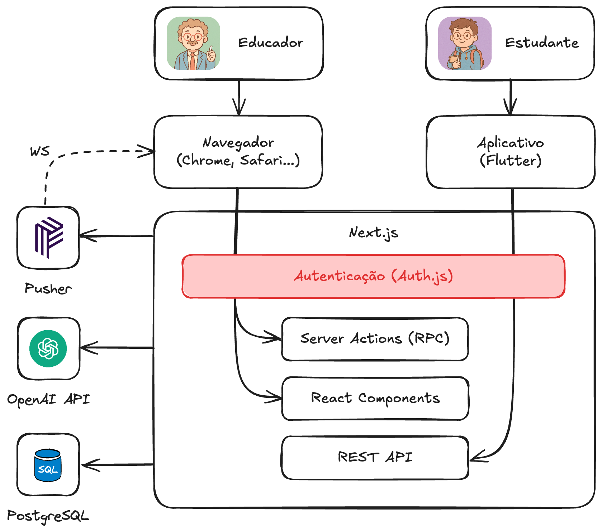
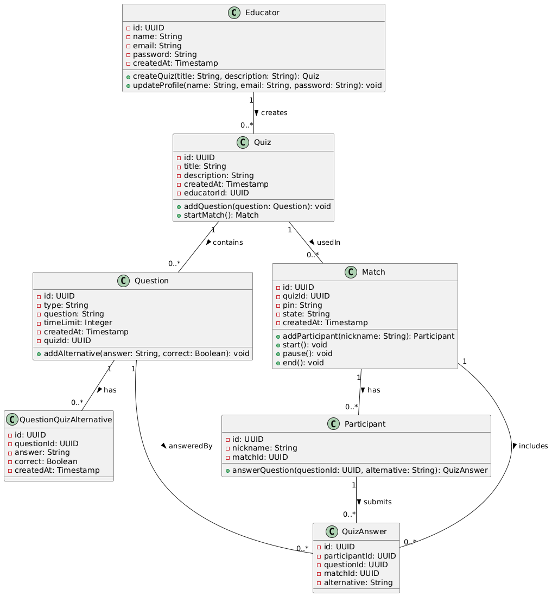
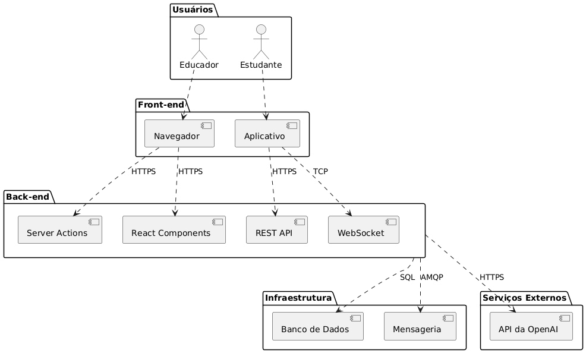
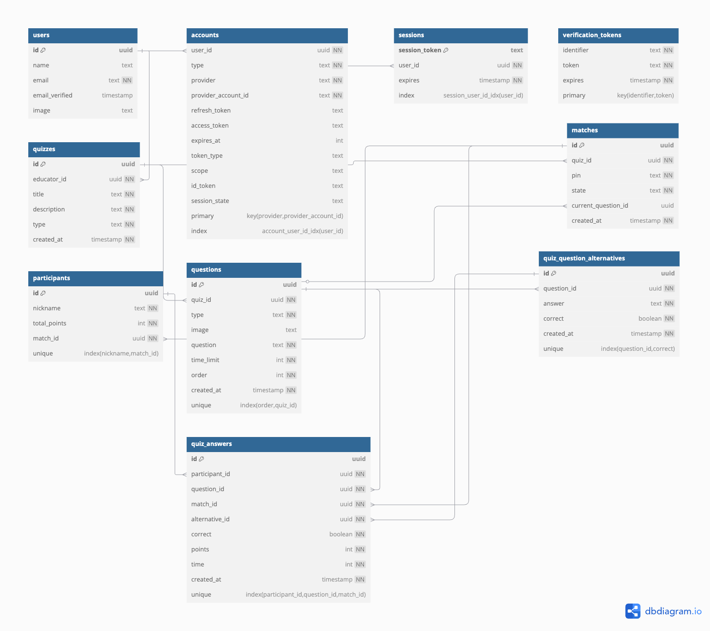

# MindRush

**Arthur Ferreira Costa, arthur.costa.1456541@sga.pucminas.br**

**Fernando Antônio Ferreira Ibrahim, 1443215@sga.pucminas.br**

**Jhonata Silveira Dias, jhonata.dias@sga.pucminas.br**

**Luca Ferrari Azalim, lazalim@pucminas.br**

**Pedro Henrique Braga de Castro, pcastro@sga.pucminas.br**

**Wanessa Dias Costa, wanessa.costa@sga.pucminas.br**

---

Professores:

**Cleiton Silva Tavares**

**Cristiano de Macêdo Neto**

**Hugo Bastos de Paula**

---

_Curso de Engenharia de Software, Campus Lourdes_

_Instituto de Informática e Ciências Exatas – Pontifícia Universidade de Minas Gerais (PUC MINAS), Belo Horizonte – MG – Brasil_

---

_**Abstract**. The MindRush platform is inserted in the context of gamification-based learning tools, aimed at streamlining the teaching-learning process through interactive quizzes. The solution is intended for educators who wish to create and apply personalized quizzes in real-time, allowing synchronous student participation and providing immediate feedback on their performance. Inspired by platforms like Kahoot!, the tool seeks to enhance the educational experience through features such as dynamic rankings, automatic quiz generation using generative artificial intelligence, and an interactive environment that favors student engagement. Furthermore, the solution incorporates adaptive learning mechanisms and real-time interactions, providing a more immersive and motivating experience._

---

## TABLE OF CONTENTS

1. [Presentation](#apresentacao "Presentation")
   1.1. Problem
   1.2. Work Objectives
   1.3. Definitions and Abbreviations
2. [Our Product](#produto "Our Product")
   2.1. Product Vision
   2.2. Our Product
   2.3. Personas
3. [Requirements](#requisitos "Requirements")
   3.1. Functional Requirements
   3.2. Non-Functional Requirements
   3.3. Architectural Constraints
   3.4. Architectural Mechanisms
4. [Modeling and Architectural Design](#modelagem "Modeling and architectural design")
   4.1. Business View (Functionalities)
   4.2. Logical View
   4.3. Data model
5. [Wireframes](#wireframes "Wireframes")
6. [Solution Design](#solucao "Solution Design")
7. [Architecture Evaluation](#avaliacao "Architecture Evaluation")

# 1. Presentation

Traditional teaching faces challenges in student engagement and learning assessment. Conventional methods, such as expository classes and written tests, do not always encourage active participation, making it difficult to identify difficulties in real-time.

Gamification platforms, such as Kahoot!, help improve student performance and make classes more dynamic (Wang and Tahir, 2020). However, there are still limitations, such as technical problems, time pressure and adaptation difficulties.

In this context, MindRush proposes an interactive quiz platform that allows educators to create and apply personalized questions in real-time, enabling synchronous student participation and providing immediate feedback. In addition to traditional functionalities, the tool also includes dynamic rankings, automatic quiz generation by artificial intelligence and adaptive learning resources, providing a more immersive experience for teachers and students.

## 1.1. Problem

The traditional teaching model presents limitations in how learning is conducted and evaluated. The main challenges include:

- Lack of student engagement in conventional methodologies.
- Difficulty for educators to assess student understanding in real-time.
- Technical problems and lack of flexibility in existing gamification platforms.
- Student stress with limited response time and difficulties keeping up with quizzes.

## 1.2. Work Objectives

**Objective:** Develop an interactive solution based on gamification to enhance engagement and effectiveness of the teaching-learning process through quizzes.

**Specific objectives:**

- Implement a web platform that allows the educator to manage quizzes and apply them in real-time.
- Implement a mobile application that enables the student to answer quizzes synchronously and receive immediate feedback on their performance.

## 1.3. Definitions and Abbreviations

| **Term / Acronym** | **Definition**                                                                                                              |
| ------------------ | --------------------------------------------------------------------------------------------------------------------------- |
| API                | Application Programming Interface. Set of routines and patterns for software integration.                                   |
| AI                 | Artificial Intelligence. Area of computer science dedicated to creating systems capable of simulating human intelligence.   |
| REST               | Architectural style for communication between distributed systems using HTTP protocol.                                      |
| CRUD               | Acronym for Create, Read, Update and Delete. Basic database persistence operations.                                         |
| UI/UX              | User Interface and User Experience. Design focused on end-user interaction and experience.                                  |
| QR Code            | Two-dimensional barcode that can be scanned to provide quick access to a URL or other information.                          |
| RESTful API        | API that follows the REST architectural style, based on resources and HTTP operations (GET, POST, PUT, DELETE).             |
| PostgreSQL         | Open-source and highly scalable relational database management system.                                                      |
| Next.js            | React framework for developing web applications with hybrid rendering (SSR, SSG and CSR).                                   |
| Flutter            | Google's framework for developing native mobile applications for iOS and Android with a single codebase.                    |
| Pusher             | Cloud-based real-time messaging service, used to implement instant communication between clients and servers via WebSocket. |
| Render             | Cloud computing platform used for deploying web applications and backend services.                                          |

# 2. Our Product

This section explores a bit more about the product to be developed.

## 2.1 Product Vision

MindRush is a gamified quiz platform designed to transform the teaching-learning process, providing an interactive and engaging experience for educators and students. Aimed at educators who seek to make their classes more dynamic and evaluate learning in a more attractive way, the tool allows the creation and application of quizzes in real-time, promoting active student participation through rankings, challenges and instant feedback. Unlike traditional solutions, such as Google Forms, which are limited to collecting responses in static forms, MindRush promotes a playful and competitive experience.

## 2.2 Our Product

| IS                                                                                                                                                                                                                                                                                                                                                         | IS NOT                                                                                                                                                                                                                                                                                               |
| :--------------------------------------------------------------------------------------------------------------------------------------------------------------------------------------------------------------------------------------------------------------------------------------------------------------------------------------------------------- | :--------------------------------------------------------------------------------------------------------------------------------------------------------------------------------------------------------------------------------------------------------------------------------------------------- |
| A personalized quiz platform that allows a synchronous gaming experience among students connected in the same room, promoting engagement and learning in an interactive and dynamic way.                                                                                                                                                                   | A platform for creating and applying questionnaires and formal exams, like Google Forms.                                                                                                                                                                                                             |
| **DOES**                                                                                                                                                                                                                                                                                                                                                   | **DOES NOT**                                                                                                                                                                                                                                                                                         |
| <ul><li>Brings gamification to the school environment through the creation of rooms where users compete with each other, testing their knowledge on a specific topic in an interactive way.</li><li>Enables automatic quiz generation based on documents provided by users, using generative AI to create relevant and contextualized questions.</li></ul> | <ul><li>Does not allow the creation of exams or forms for individual assessment</li><li>Does not focus on asynchronous teaching or self-taught learning, requiring synchronous interaction between users.</li><li>Does not generate detailed performance reports for long-term monitoring.</li></ul> |

## 2.3 Personas

<h2>Educators</h2>
<table>
  <tr>
    <td style="vertical-align: top; width: 150px;">
      
    </td>
    <td style="vertical-align: top; padding-left: 10px;">
      <strong>Name:</strong> Lucas Almeida  
      <strong>Age:</strong> 43 years old  
      <strong>Hobby:</strong> Playing chess and watching science documentaries. 
      <strong>Work:</strong> Software Engineering Professor at PUC Minas. 
      <strong>Personality:</strong> Analytical and somewhat shy. Has great technical expertise, but finds it difficult to make his classes more dynamic and engaging. 
      <strong>Dream:</strong> Help his students to really get interested in the content and learn meaningfully.  
      <strong>Pain Points:</strong>
	  	<ul>
	  		<li>Difficulty in keeping students focused and engaged in classes.</li>
	  		<li>Limited time to prepare interactive materials.</li>
		</ul>  
    </td>
  </tr>
</table>
<table>
  <tr>
    <td style="vertical-align: top; width: 150px;">
      
    </td>
    <td style="vertical-align: top; padding-left: 10px;">
      <strong>Name:</strong> Carolina Mendes  
      <strong>Age:</strong> 32 years old  
      <strong>Hobby:</strong> Recording videos for her educational YouTube channel and practicing yoga  
      <strong>Work:</strong> Computer Science Professor in distance learning modality  
      <strong>Personality:</strong> Communicative, adaptable and innovative. Always seeks new ways to engage her students in the digital environment, using active methodologies and interactive tools.  
      <strong>Dream:</strong> Create an online teaching experience as dynamic and engaging as face-to-face classes, increasing student learning and participation rates. 
      <strong>Pain Points:</strong>
	  	<ul>
	  		<li>Notices that many students watch classes passively and without real engagement</li>
	  		<li>Has difficulties in effectively assessing student understanding in the online environment</li>
        <li>Seeks tools that enable interactivity and engagement without compromising content organization</li>
		</ul>  
    </td>
  </tr>
</table>

<h2>Students</h2>
<table>
  <tr>
    <td style="vertical-align: top; width: 150px;">
      
    </td>
    <td style="vertical-align: top; padding-left: 10px;">
      <strong>Name:</strong> André Castro  
      <strong>Age:</strong> 21 years old  
      <strong>Hobby:</strong> Playing video games and hanging out with friends  
      <strong>Work:</strong> Information Systems student at PUC Minas. 
      <strong>Personality:</strong> Unfocused, procrastinator and unmotivated with the course. He is interested in technology, but has difficulty concentrating on more theoretical subjects. 
      <strong>Dream:</strong> Complete college and get a job, but still doesn't know which area he wants to work in.  
	<strong>Pain Points:</strong>
	  	<ul>
	  		<li>Finds it difficult to maintain focus in expository classes and frequently loses interest</li>
	  		<li>Has difficulties following the content, especially in subjects that require more logic and reasoning</li>
			<li>Needs external stimuli to study and review content before exams</li>
		</ul>  
    </td>
  </tr>
</table>
<table>
  <tr>
    <td style="vertical-align: top; width: 150px;">
      
    </td>
    <td style="vertical-align: top; padding-left: 10px;">
      <strong>Name:</strong> Mariana Santos 
      <strong>Age:</strong> 25 years old  
      <strong>Hobby:</strong> Participating in hackathons and consuming technology content  
      <strong>Work:</strong> Software Engineering student and junior developer at a software startup  
      <strong>Personality:</strong> Focused, determined and self-taught. Likes challenges and always seeks to learn beyond what is taught in the classroom.  
      <strong>Dream:</strong> Become a senior software engineer and work on innovative projects abroad. 
	<strong>Pain Points:</strong>
	  	<ul>
	  		<li>Feels that traditional teaching often doesn't keep up with the pace of the technology market.</li>
	  		<li>Thinks that some academic methodologies are outdated and not very engaging.</li>
			  <li>Seeks ways to test and improve her knowledge in a more interactive and applied manner.</li>
		</ul>  
    </td>
  </tr>
</table>

# 3. Requirements

This section describes the requirements covered in this architectural description, divided into two groups: functional and non-functional.

## 3.1. Functional Requirements

| **ID** | **Description**                                                        | **Priority** | **Platform** |
| ------ | ---------------------------------------------------------------------- | ------------ | ------------ |
| RF1    | The educator registers in the system.                                  | Essential    | Web          |
| RF2    | The educator manages quizzes.                                          | Essential    | Web          |
| RF3    | The educator generates a quiz from any topic using generative AI.      | Optional     | Web          |
| RF4    | The educator generates a quiz from a PDF document using generative AI. | Optional     | Web          |
| RF5    | The educator manages quiz questions.                                   | Essential    | Web          |
| RF6    | The educator generates a match from a quiz.                            | Essential    | Web          |
| RF7    | The educator starts and ends a match.                                  | Essential    | Web          |
| RF8    | The educator monitors the match progress.                              | Desirable    | Web          |
| RF9    | The student enters a code to access a match.                           | Essential    | Mobile       |
| RF10   | The student scans a QR code to access a match.                         | Optional     | Mobile       |
| RF11   | The student enters a nickname that will identify them in the match.    | Essential    | Mobile       |
| RF12   | The student answers match questions in real-time.                      | Essential    | Mobile       |
| RF13   | The student views the match score ranking at the end of each question. | Desirable    | Web          |
| RF14   | The student views the final score ranking at the end of the match.     | Desirable    | Web          |
| RF15   | The educator views previously occurred matches.                        | Desirable    | Web          |

**Note:** the "Sprint" and "Status" columns have been removed, since the planning and completion status of each requirement are being controlled through [GitHub Projects](https://github.com/orgs/ICEI-PUC-Minas-PPLES-TI/projects/556).

## 3.2. Non-Functional Requirements

| **ID** | **Description**                                                                                                                                                                                                                                                                |
| ------ | ------------------------------------------------------------------------------------------------------------------------------------------------------------------------------------------------------------------------------------------------------------------------------ |
| RNF1   | The system must be compatible with web browsers Google Chrome (v134), Mozilla Firefox (v135), Microsoft Edge (v133) and Safari (v18.3).                                                                                                                                        |
| RNF2   | The web front-end interface must be compatible and offer responsiveness for screens between 1280 and 1920 pixels wide.                                                                                                                                                         |
| RNF3   | The web front-end interface must be available in light, dark and system modes.                                                                                                                                                                                                 |
| RNF4   | Back-end development must adopt the REST pattern for API structuring, meeting level 2 of Richardson's maturity model.                                                                                                                                                          |
| RNF5   | The system must require, from educators, authentication with a Google account.                                                                                                                                                                                                 |
| RNF6   | The system must use the _Session Based Authentication_ approach, storing user sessions in database.                                                                                                                                                                            |
| RNF7   | Student responses to quizzes must be linked exclusively to the username chosen by them at the beginning of each match, preventing direct identification of participants through personal information, ensuring anonymity and privacy of players during and after the activity. |
| RNF8   | The system must support up to 60 students participating in a quiz at the same time, without significant increase in response time.                                                                                                                                             |
| RNF9   | The processing time of requests made to the API must be less than 500ms, considering only the execution time on the server and disregarding network latency.                                                                                                                   |
| RNF10  | The system cannot present the security failure "broken access control".                                                                                                                                                                                                        |
| RNF11  | The system cannot present the security failure "cryptographic failures".                                                                                                                                                                                                       |
| RNF12  | The system cannot present the security failure "injection"                                                                                                                                                                                                                     |

## 3.3. Architectural Constraints

The architectural constraints of the project are as follows:

- The system must adopt a web service-based model.
- It must offer support for services in both web and mobile environments.
- Web and mobile versions must be developed using different technologies.
- It must include a real-time communication mechanism (messaging).
- It must use cloud computing services.
- Hosting must be performed on a free cloud platform.
- Testing strategies must be implemented to ensure system quality.
- The system must allow multiple clients to connect simultaneously to a single server, enabling concurrent operations.

## 3.4. Architectural Mechanisms

The architectural mechanisms of MindRush were defined to ensure performance, scalability and security. The table below summarizes the main technological choices:

| **Analysis**     | **Design**                            | **Implementation**                        |
| ---------------- | ------------------------------------- | ----------------------------------------- |
| Persistence      | Relational Database + ORM             | PostgreSQL + Drizzle                      |
| Back-end         | REST API + RPC                        | Route Handlers + Server Actions (Next.js) |
| Front-end        | Single Page Application               | React + Next.js                           |
| Application      | Hybrid technology for iOS and Android | Flutter                                   |
| Messaging        | Event driven                          | Pusher                                    |
| Software Testing | Unit and integration tests            | Jest                                      |
| Deploy           | Managed cloud                         | Render                                    |

# 4. Modeling and Architectural Design

Figure 1 presents an overview of the proposed solution, illustrating the project's macro-architecture.

**Figure 1 - Solution overview. Source: the author.**

Brief description of the diagram:

- **Users**: The educator creates and manages quizzes, while the student participates in matches.
- **Front-end**: Web interface (Next.js) for educators and mobile application (Flutter) for students.
- **Back-end**: Next.js API centralizes the logic, with modular services for authentication, quizzes and matches.
- **Infrastructure**: PostgreSQL stores data, Pusher manages messages and Generative AI API generates quizzes automatically.
- **Flow**: The Front-end consumes the API, which interacts with the database, messaging and AI to deliver a dynamic and scalable experience.

## 4.1. Business View (Functionalities)

1. **Registration and Authentication**

   - The educator can create an account in the system.
   - The educator can log in to access their functionalities.

2. **Quiz Management**

   - The educator can edit and delete existing quizzes.
   - The educator can create personalized quizzes, creating them from scratch or using generative AI.

3. **Question Management**

   - The educator can add, edit and remove questions in a quiz.

4. **Quiz Execution**

   - The educator can start a quiz match.
   - The educator can end the match at any time.
   - The educator can view the match progress and student performance.

5. **Student Participation**

   - The student can enter a match by entering a unique code.
   - The student can scan a QR Code to access the match quickly.
   - The student can enter their name before participating.
   - The student can answer questions in real-time.

6. **Interactivity and Feedback**
   - The system displays the participants' ranking at the end of each question.
   - The system displays the final ranking at the end of the match.
   - The student receives immediate feedback on their answers.

### User Stories

Below are the user stories for **MindRush**, structured according to the needs of educators and students.

| **AS A...**  | **I WANT/NEED...**                                 | **SO THAT...**                                      |
| ------------ | -------------------------------------------------- | --------------------------------------------------- |
| **Educator** | Create personalized quizzes                        | Evaluate student learning dynamically               |
| **Educator** | Generate quizzes automatically with generative AI  | Save time in creating questions                     |
| **Educator** | Start and end a quiz match                         | Control the pace of classroom activity              |
| **Educator** | Monitor student progress during the quiz           | Identify difficulties in real-time                  |
| **Educator** | View participants' ranking at the end of the match | Stimulate student engagement                        |
| **Educator** | Share a code for students to enter the quiz        | Facilitate access and participation in the activity |
| **Student**  | Enter a code and join the match                    | Participate in the quiz interactively               |
| **Student**  | Answer questions in real-time                      | Test my knowledge and learn actively                |
| **Student**  | View my position in the ranking                    | Track my performance and compete healthily          |
| **Student**  | Receive immediate feedback on my answers           | Know if I'm getting the questions right or wrong    |
| **Student**  | Scan a QR Code to quickly enter the match          | Facilitate access to the quiz without typing codes  |

## 4.2. Logical View

This section presents the artifacts that were used to design the system.

### Class Diagram

The **class diagram** was used to model the static structure of the system, representing the main entities, their attributes and relationships. It allows visualizing how **educators, quizzes, matches and answers** interact, ensuring a coherent design aligned with functional and non-functional requirements. In addition, the inheritance applied to questions (multiple choice and true/false) favors extensibility and code reuse.

**Figure 2 – Class diagram. Source: the author.**

### Component diagram

The **component diagram** was employed to represent the system architecture, highlighting **modules, interfaces and their interactions**. It highlights the separation between **Front-end (Web and Mobile), Back-end (API), Database and Messaging**, ensuring a clear view of communication between services. This modular model facilitates scalability, maintenance and implementation of new functionalities.

**Figure 3 – Component diagram. Source: the author.**

#### Architectural Styles/Patterns Used

1. **Client-Server Architecture**: The **Web Front-end (Next.js)** and the **Flutter Application** communicate with the **Back-end (Next.js API)** via **REST API**.
2. **Layered Architecture**: Separation between **user interface, business logic and persistence**.
3. **RESTful API**: The Back-end exposes **HTTP services** for clients to consume.
4. **Event-Driven Architecture (EDA)**: **Pusher** manages **match events and real-time updates**.
5. **Cross-Platform**: **Flutter** ensures compatibility for Android and iOS.

---

#### Brief Description of Components

| **Component**        | **Role within Architecture**                                                                          |
| -------------------- | ----------------------------------------------------------------------------------------------------- |
| **Educator**         | Creates and manages quizzes, applies matches and monitors student performance via browser.            |
| **Student**          | Participates in matches and answers questions in real-time through the mobile application.            |
| **Browser**          | Web interface (Next.js) used by educators to manage quizzes and matches.                              |
| **Application**      | Flutter application used by students to interact with gamified matches.                               |
| **Server Actions**   | Executes critical actions on the server, such as controlling match business logic.                    |
| **React Components** | Web interface components used on the educator platform.                                               |
| **REST API**         | Provides HTTP services consumed by the application, such as authentication and answer submission.     |
| **WebSocket**        | Provides real-time communication between back-end and application, sending instant updates.           |
| **Database**         | Stores data related to users, quizzes, matches and results (PostgreSQL).                              |
| **Messaging**        | Manages events for asynchronous communication between services (Pusher).                              |
| **OpenAI API**       | External service that automatically generates quizzes from themes or documents provided by educators. |

---

#### Component Classification

| **Type**      | **Components**                                                                  |
| ------------- | ------------------------------------------------------------------------------- |
| **Reused**    | Browsers, PostgreSQL, Pusher.                                                   |
| **Acquired**  | Generative AI API (external service, possibly paid).                            |
| **Developed** | Next.js (Front-end and Back-end), Flutter Application, Quiz and Match Services. |

## 4.3. Data Model

The diagram in Figure 4 represents the system's data model.

- The **`educator` table** stores data of educators responsible for creating quizzes, including information such as name and email.
- The **`quiz` table** contains quizzes created by educators, with fields for title, description and creation date, plus the relationship with the responsible educator.
- The **`question` table** stores quiz questions, with information such as question type (multiple choice or true/false), question text and time limit.
- The **`question_quiz_alternatives` table** records alternatives for multiple choice questions, identifying which alternative is correct.
- The **`match` table** represents quiz execution sessions (or matches), containing the match PIN code and current state (waiting, running or finished).
- The **`participant` table** stores participants who joined a match, identified by nickname and link to the specific match.
- The **`quiz_answer` table** records participant responses to each question in a specific match, ensuring that each combination of participant, question and match is unique.

The relationships between tables were established to ensure referential integrity of the system, allowing tracking of all stages, from quiz creation to player participation and response in a specific match.

**Figure 4 – Database Logical Diagram. Source: the author.**

# 5. Wireframes

The interface wireframes for the project are available in the document [wireframes.md](wireframes.md).

# 6. Solution Design

The solution design is available in the document [solution_design.md](solution_design.md).

# 7. Architecture Evaluation

The project architecture evaluation is available in the document [atam.md](atam.md).
