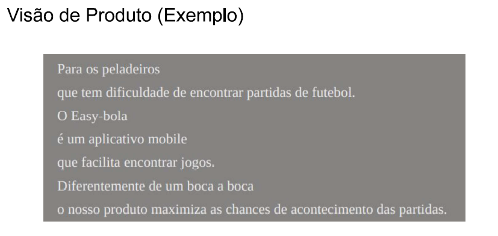
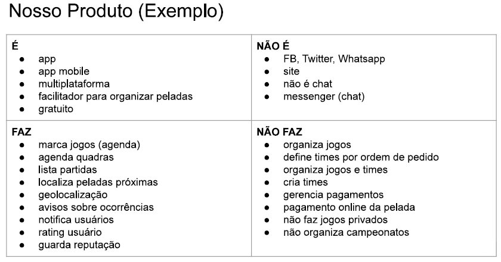
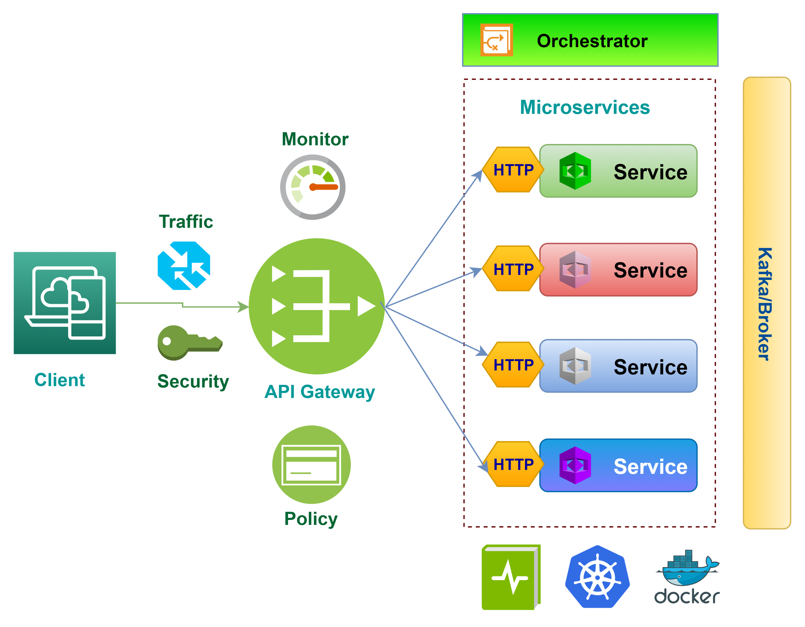

# MindRush

**Arthur Ferreira Costa, arthur.costa.1456541@sga.pucminas.br**

**Fernando Antônio Ferreira Ibrahim, 1443215@sga.pucminas.br**

**Jhonata Silveira Dias, jhonata.dias@sga.pucminas.br**

**Luca Ferrari Azalim, lazalim@pucminas.br**

**Pedro Henrique Braga de Castro, pcastro@sga.pucminas.br**

**Wanessa Dias Costa, wanessa.costa@sga.pucminas.br**

---

Professores:

**Cleiton Silva Tavares**

**Cristiano de Macêdo Neto**

**Hugo Bastos de Paula**

---

_Curso de Engenharia de Software, Campus Lourdes_

_Instituto de Informática e Ciências Exatas – Pontifícia Universidade de Minas Gerais (PUC MINAS), Belo Horizonte – MG – Brasil_

---

_**Resumo**. A plataforma MindRush está inserida no contexto de ferramentas de aprendizado baseadas em gamificação, voltadas para a dinamização do processo de ensino-aprendizagem por meio de quizzes interativos. A solução é destinada a educadores que desejam criar e aplicar quizzes personalizados em tempo real, permitindo a participação síncrona dos alunos e fornecendo feedback imediato sobre seu desempenho. Inspirada em plataformas como Kahoot!, a ferramenta busca aprimorar a experiência educacional por meio de funcionalidades como rankings dinâmicos, geração automática de quizzes utilizando inteligência artificial generativa e um ambiente interativo que favorece o engajamento dos estudantes. Além disso, a solução incorpora mecanismos de aprendizado adaptativo e interações em tempo real, proporcionando uma experiência mais imersiva e motivadora._

---

## SUMÁRIO

1. [Apresentação](#apresentacao "Apresentação")  
   1.1. Problema  
   1.2. Objetivos do trabalho  
   1.3. Definições e Abreviaturas  

2. [Nosso Produto](#produto "Nosso Produto")  
   2.1. Visão do Produto  
   2.2. Nosso Produto  
   2.3. Personas  

3. [Requisitos](#requisitos "Requisitos")  
   3.1. Requisitos Funcionais  
   3.2. Requisitos Não-Funcionais  
   3.3. Restrições Arquiteturais  
   3.4. Mecanismos Arquiteturais  

4. [Modelagem](#modelagem "Modelagem e projeto arquitetural")  
   4.1. Visão de Negócio  
   4.2. Visão Lógica  
   4.3. Modelo de dados (opcional)  

5. [Wireframes](#wireframes "Wireframes")  

6. [Solução](#solucao "Projeto da Solução")  

7. [Avaliação](#avaliacao "Avaliação da Arquitetura")  
   7.1. Cenários  
   7.2. Avaliação  

8. [Referências](#referencias "REFERÊNCIAS") 

9. [Apêndices](#apendices "APÊNDICES") 
   9.1 Ferramentas  

# 1. Apresentação

Nota-se que o ensino tradicional enfrenta desafios no engajamento dos alunos e na avaliação eficaz do aprendizado. Métodos convencionais, como aulas expositivas e provas escritas, não garantem uma participação ativa e muitas vezes dificultam a identificação de dificuldades em tempo real.

Estudos apontam que o uso de gamificação no ensino, como no **Kahoot!**, melhora o desempenho dos alunos e a dinâmica em sala de aula, no entanto, ainda há desafios, como problemas técnicos, estresse com o tempo e dificuldades na adaptação dos estudantes (Wang e Tahir, 2020).

Dessa forma, uma plataforma que combine aprendizado gamificado, interatividade em tempo real e feedback imediato pode ser uma solução eficaz para esse problema. O **MindRush** propõe uma abordagem inovadora, permitindo que professores criem quizzes personalizados, enquanto os alunos participam de maneira síncrona, tornando o processo de aprendizado mais dinâmico e envolvente.

## 1.1. Problema

O modelo tradicional de ensino apresenta limitações na forma como o aprendizado é conduzido e avaliado. Os principais desafios incluem:

- Falta de engajamento dos alunos em metodologias convencionais.
- Dificuldade dos professores em avaliar a compreensão dos estudantes em tempo real.
- Problemas técnicos e falta de flexibilidade em plataformas de gamificação existentes.
- Estresse dos alunos com o tempo limitado de resposta e dificuldades para acompanhar os quizzes.

## 1.2. Objetivos do trabalho

O objetivo principal deste trabalho é desenvolver uma plataforma interativa baseada em gamificação para auxiliar professores e alunos no processo de ensino-aprendizagem.

Os objetivos específicos são:

- Criar um sistema de quizzes interativos e personalizáveis.
- Fornecer feedback imediato aos alunos, aumentando a retenção do aprendizado.
- Implementar um ranking dinâmico para incentivar a participação ativa.
- Utilizar inteligência artificial generativa para facilitar a criação de quizzes.
- Garantir uma experiência fluida e acessível para diferentes dispositivos.

## 1.3. Definições e Abreviaturas

- **Gamificação**: Aplicação de elementos de jogos para tornar o aprendizado mais envolvente.
- **Quizzes Síncronos**: Questionários interativos realizados simultaneamente por múltiplos usuários.
- **IA Generativa**: Inteligência artificial capaz de criar automaticamente conteúdos, como perguntas e respostas para quizzes.
- **Feedback Imediato**: Retorno instantâneo sobre o desempenho dos alunos, permitindo ajustes no aprendizado.
- **Ranking Dinâmico**: Sistema de pontuação atualizado em tempo real, estimulando a competição saudável entre os participantes.

# 2. Nosso Produto

_Estão seçaõ explora um pouco mais o produto a ser desenvolvido_

## 2.1 Visão do Produto

## 2.2 Nosso Produto

## 2.3 Personas

<h2>Persona 1</h2>
<table>
  <tr>
    <td style="vertical-align: top; width: 150px;">
      
    </td>
    <td style="vertical-align: top; padding-left: 10px;">
      <strong>Nome:</strong> Ana Souza  
      <strong>Idade:</strong> 32 anos  
      <strong>Hobby:</strong> Ler livros de ficção científica  
      <strong>Trabalho:</strong> Desenvolvedora de software  
      <strong>Personalidade:</strong> Analítica, criativa e determinada  
      <strong>Sonho:</strong> Criar uma startup de tecnologia  
      <strong>Dores:</strong> Falta de tempo para equilibrar trabalho e vida pessoal  
    </td>
  </tr>
</table>

# 3. Requisitos

_Esta seção descreve os requisitos comtemplados nesta descrição arquitetural, divididos em dois grupos: funcionais e não funcionais._

## 3.1. Requisitos Funcionais

_Enumere os requisitos funcionais previstos para a sua aplicação. Concentre-se nos requisitos funcionais que sejam críticos para a definição arquitetural. Lembre-se de listar todos os requisitos que são necessários para garantir cobertura arquitetural. Esta seção deve conter uma lista de requisitos ainda sem modelagem. Na coluna Prioridade utilize uma escala (do mais prioritário para o menos): Essencial, Desejável, Opcional._

| **ID** | **Descrição**                                                              | **Prioridade** | **Plataforma** |
| ------ | -------------------------------------------------------------------------- | -------------- | -------------- |
| RF1    | O educador se cadastra no sistema.                                         | Essencial      | Web            |
| RF2    | O educador gerencia os quizzes.                                            | Essencial      | Web            |
| RF3    | O educador gera um quiz a partir de um tema qualquer usando IA generativa. | Opcional       | Web            |
| RF4    | O educador gera um quiz a partir de um documento PDF usando IA generativa. | Opcional       | Web            |
| RF5    | O educador gerencia as questões dos quizzes.                               | Essencial      | Web            |
| RF6    | O educador gera uma partida a partir de um quiz.                           | Essencial      | Web            |
| RF7    | O educador inicia, pausa e encerra a partida.                              | Essencial      | Web            |
| RF8    | O educador acompanha o andamento da partida.                               | Desejável      | Web            |
| RF9    | O estudante informa o código da partida.                                   | Essencial      | Móvel          |
| RF10   | O estudante escaneia o código QR da partida.                               | Opcional       | Móvel          |
| RF11   | O estudante entra na partida informando seu nome.                          | Essencial      | Móvel          |
| RF12   | O estudante responde às questões da partida em tempo real.                 | Essencial      | Móvel          |
| RF13   | O sistema exibe o ranque da partida ao final de cada questão.              | Desejável      | Móvel          |
| RF14   | O sistema exibe o ranque final da partida.                                 | Desejável      | Móvel          |

**Observação:** as colunas "Sprint" e "Status" foram removidas, uma vez que o planejamento e o estado de conclusão de cada requisito estão sendo controlados por meio do [GitHub Projects](https://github.com/orgs/ICEI-PUC-Minas-PPLES-TI/projects/556).

## 3.2. Requisitos Não-Funcionais

_Enumere os requisitos não-funcionais previstos para a sua aplicação. Entre os requisitos não funcionais, inclua todos os requisitos que julgar importante do ponto de vista arquitetural ou seja os requisitos que terão impacto na definição da arquitetura. Os requisitos devem ser descritos de forma completa e preferencialmente quantitativa._

| **ID** | **Descrição** |
| ------ | ------------- |
| RNF001 |               |
| RNF002 |               |
|        |               |
|        |               |
|        |               |

Obs: acrescente mais linhas, se necessário.

## 3.3. Restrições Arquiteturais

As restrições arquiteturais do projeto são as seguintes:

- O sistema deve adotar um modelo baseado em web service.
- Deve oferecer suporte a serviços tanto no ambiente web quanto no móvel.
- As versões web e móvel devem ser desenvolvidas utilizando tecnologias distintas.
- Deve incluir um mecanismo de comunicação em tempo real (mensageria).
- Deve utilizar serviços de computação em nuvem.
- A hospedagem deve ser realizada em uma plataforma de nuvem gratuita.
- Estratégias de testes devem ser implementadas para garantir a qualidade do sistema.
- O sistema deve permitir que múltiplos clientes se conectem simultaneamente a um único servidor, possibilitando operações concorrentes.

## 3.4. Mecanismos Arquiteturais

| **Análise**       | **Design**                            | **Implementação** |
| ----------------- | ------------------------------------- | ----------------- |
| Persistência      | Banco de Dados Relacional             | PostgreSQL        |
| Back-end          | RESTful API                           | Next.js           |
| Web App           | Single Page Application               | Next.js           |
| Aplicativo        | Tecnologia híbrida para iOS e Android | Flutter           |
| Mensageria        | Event driven                          | RabbitMQ          |
| Teste de Software | Testes unitários e de integração      | Jest              |
| Deploy            | Cloud gerenciado                      | Render            |

# 4. Modelagem e Projeto Arquitetural

_Apresente uma visão geral da solução proposta para o projeto e explique brevemente esse diagrama de visão geral, de forma textual. Esse diagrama não precisa seguir os padrões da UML, e deve ser completo e tão simples quanto possível, apresentando a macroarquitetura da solução._

**Figura 1 - Visão Geral da Solução (fonte: https://medium.com)**

Obs: substitua esta imagem por outra, adequada ao seu projeto (cada arquitetura é única).

## 4.1. Visão de Negócio (Funcionalidades)

_Apresente uma lista simples com as funcionalidades previstas no projeto (escopo do produto)._

1. O sistema deve...
2. O sistema deve...
3. ...

Obs: a quantidade e o escopo das funcionalidades deve ser negociado com os professores/orientadores do trabalho.

### Histórias de Usuário

_Nesta seção, você deve descrever estórias de usuários seguindo os métodos ágeis. Lembre-se das características de qualidade das estórias de usuários, ou seja, o que é preciso para descrever boas histórias de usuários._

Exemplos de Histórias de Usuário:

- Como Fulano eu quero poder convidar meus amigos para que a gente possa se reunir...

- Como Cicrano eu quero poder organizar minhas tarefas diárias, para que...

- Como gerente eu quero conseguir entender o progresso do trabalho do meu time, para que eu possa ter relatórios periódicos dos nossos acertos e falhas.

| EU COMO... `PERSONA` | QUERO/PRECISO ... `FUNCIONALIDADE` | PARA ... `MOTIVO/VALOR`                |
| -------------------- | ---------------------------------- | -------------------------------------- |
| Usuário do sistema   | Registrar minhas tarefas           | Não esquecer de fazê-las               |
| Administrador        | Alterar permissões                 | Permitir que possam administrar contas |

## 4.2. Visão Lógica

_Apresente os artefatos que serão utilizados descrevendo em linhas gerais as motivações que levaram a equipe a utilizar estes diagramas._

### Diagrama de Classes

**Figura 2 – Diagrama de classes (exemplo). Fonte: o próprio autor.**

Obs: Acrescente uma breve descrição sobre o diagrama apresentado na Figura 3.

### Diagrama de componentes

_Apresente o diagrama de componentes da aplicação, indicando, os elementos da arquitetura e as interfaces entre eles. Liste os estilos/padrões arquiteturais utilizados e faça uma descrição sucinta dos componentes indicando o papel de cada um deles dentro da arquitetura/estilo/padrão arquitetural. Indique também quais componentes serão reutilizados (navegadores, SGBDs, middlewares, etc), quais componentes serão adquiridos por serem proprietários e quais componentes precisam ser desenvolvidos._

**Figura 3 – Diagrama de Componentes (exemplo). Fonte: o próprio autor.**

_Apresente uma descrição detalhada dos artefatos que constituem o diagrama de implantação._

Ex: conforme diagrama apresentado na Figura X, as entidades participantes da solução são:

- **Componente 1** - Lorem ipsum dolor sit amet, consectetur adipiscing elit. Cras nunc magna, accumsan eget porta a, tincidunt sed mauris. Suspendisse orci nulla, sagittis a lorem laoreet, tincidunt imperdiet ipsum. Morbi malesuada pretium suscipit.
- **Componente 2** - Praesent nec nisi hendrerit, ullamcorper tortor non, rutrum sem. In non lectus tortor. Nulla vel tincidunt eros.

## 4.3. Modelo de dados (opcional)

_Caso julgue necessário para explicar a arquitetura, apresente o diagrama de classes ou diagrama de Entidade/Relacionamentos ou tabelas do banco de dados. Este modelo pode ser essencial caso a arquitetura utilize uma solução de banco de dados distribuídos ou um banco NoSQL._

 ")

**Figura 4 – Diagrama de Entidade Relacionamento (ER) - exemplo. Fonte: o próprio autor.**

Obs: Acrescente uma breve descrição sobre o diagrama apresentado na Figura 3.

# 5. Wireframes

> Wireframes são protótipos das telas da aplicação usados em design de interface para sugerir a
> estrutura de um site web e seu relacionamentos entre suas
> páginas. Um wireframe web é uma ilustração semelhante ao
> layout de elementos fundamentais na interface.

# 6. Projeto da Solução

_Apresente as telas dos sistema construído com uma descrição sucinta de cada uma das interfaces._

# 7. Avaliação da Arquitetura

_Esta seção descreve a avaliação da arquitetura apresentada, baseada no método ATAM._

## 7.1. Cenários

_Apresente os cenários de testes utilizados na realização dos testes da sua aplicação. Escolha cenários de testes que demonstrem os requisitos não funcionais sendo satisfeitos. Os requisitos a seguir são apenas exemplos de possíveis requisitos, devendo ser revistos, adequados a cada projeto e complementados de forma a terem uma especificação completa e auto-explicativa._

**Cenário 1 - Acessibilidade:** Suspendisse consequat consectetur velit. Sed sem risus, dictum dictum facilisis vitae, commodo quis leo. Vivamus nulla sem, cursus a mollis quis, interdum at nulla. Nullam dictum congue mauris. Praesent nec nisi hendrerit, ullamcorper tortor non, rutrum sem. In non lectus tortor. Nulla vel tincidunt eros.

**Cenário 2 - Interoperabilidade:** Pellentesque habitant morbi tristique senectus et netus et malesuada fames ac turpis egestas. Fusce ut accumsan erat. Pellentesque in enim tempus, iaculis sem in, semper arcu.

**Cenário 3 - Manutenibilidade:** Phasellus magna tellus, consectetur quis scelerisque eget, ultricies eu ligula. Sed rhoncus fermentum nisi, a ullamcorper leo fringilla id. Nulla lacinia sem vel magna ornare, non tincidunt ipsum rhoncus. Nam euismod semper ante id tristique. Mauris vel elit augue.

**Cenário 4 - Segurança:** Suspendisse consectetur porta tortor non convallis. Sed lobortis erat sed dignissim dignissim. Nunc eleifend elit et aliquet imperdiet. Ut eu quam at lacus tincidunt fringilla eget maximus metus. Praesent finibus, sapien eget molestie porta, neque turpis congue risus, vel porttitor sapien tortor ac nulla. Aliquam erat volutpat.

## 7.2. Avaliação

_Apresente as medidas registradas na coleta de dados. O que não for possível quantificar apresente uma justificativa baseada em evidências qualitativas que suportam o atendimento do requisito não-funcional. Apresente uma avaliação geral da arquitetura indicando os pontos fortes e as limitações da arquitetura proposta._

| **Atributo de Qualidade:** | Segurança                                                                                                                                                                                                                                                              |
| -------------------------- | ---------------------------------------------------------------------------------------------------------------------------------------------------------------------------------------------------------------------------------------------------------------------- |
| **Requisito de Qualidade** | Acesso aos recursos restritos deve ser controlado                                                                                                                                                                                                                      |
| **Preocupação:**           | Os acessos de usuários devem ser controlados de forma que cada um tenha acesso apenas aos recursos condizentes as suas credenciais.                                                                                                                                    |
| **Cenários(s):**           | Cenário 4                                                                                                                                                                                                                                                              |
| **Ambiente:**              | Sistema em operação normal                                                                                                                                                                                                                                             |
| **Estímulo:**              | Acesso do administrador do sistema as funcionalidades de cadastro de novos produtos e exclusão de produtos.                                                                                                                                                            |
| **Mecanismo:**             | O servidor de aplicação (Rails) gera um _token_ de acesso para o usuário que se autentica no sistema. Este _token_ é transferido para a camada de visualização (Angular) após a autenticação e o tratamento visual das funcionalidades podem ser tratados neste nível. |
| **Medida de Resposta:**    | As áreas restritas do sistema devem ser disponibilizadas apenas quando há o acesso de usuários credenciados.                                                                                                                                                           |

**Considerações sobre a arquitetura:**

| **Riscos:**                  | Não existe |
| ---------------------------- | ---------- |
| **Pontos de Sensibilidade:** | Não existe |
| _ **Tradeoff** _ **:**       | Não existe |

Evidências dos testes realizados

_Apresente imagens, descreva os testes de tal forma que se comprove a realização da avaliação._

# 8. REFERÊNCIAS

_Como um projeto da arquitetura de uma aplicação não requer revisão bibliográfica, a inclusão das referências não é obrigatória. No entanto, caso você deseje incluir referências relacionadas às tecnologias, padrões, ou metodologias que serão usadas no seu trabalho, relacione-as de acordo com a ABNT._

Verifique no link abaixo como devem ser as referências no padrão ABNT:

http://www.pucminas.br/imagedb/documento/DOC\_DSC\_NOME\_ARQUI20160217102425.pdf

**[1]** - _ELMASRI, Ramez; NAVATHE, Sham. **Sistemas de banco de dados**. 7. ed. São Paulo: Pearson, c2019. E-book. ISBN 9788543025001._

**[2]** - _COPPIN, Ben. **Inteligência artificial**. Rio de Janeiro, RJ: LTC, c2010. E-book. ISBN 978-85-216-2936-8._

**[3]** - _CORMEN, Thomas H. et al. **Algoritmos: teoria e prática**. Rio de Janeiro, RJ: Elsevier, Campus, c2012. xvi, 926 p. ISBN 9788535236996._

**[4]** - _SUTHERLAND, Jeffrey Victor. **Scrum: a arte de fazer o dobro do trabalho na metade do tempo**. 2. ed. rev. São Paulo, SP: Leya, 2016. 236, [4] p. ISBN 9788544104514._

**[5]** - _RUSSELL, Stuart J.; NORVIG, Peter. **Inteligência artificial**. Rio de Janeiro: Elsevier, c2013. xxi, 988 p. ISBN 9788535237016._

# 9. APÊNDICES

_Inclua o URL do repositório (Github, Bitbucket, etc) onde você armazenou o código da sua prova de conceito/protótipo arquitetural da aplicação como anexos. A inclusão da URL desse repositório de código servirá como base para garantir a autenticidade dos trabalhos._

## 9.1 Ferramentas

| Ambiente              | Plataforma        | Link de Acesso                |
| --------------------- | ----------------- | ----------------------------- |
| Repositório de código | GitHub            | https://github.com/XXXXXXX    |
| Hospedagem do site    | Heroku            | https://XXXXXXX.herokuapp.com |
| Protótipo Interativo  | MavelApp ou Figma | https://figma.com/XXXXXXX     |
| Documentação de teste | Github            | https://githun.com/xxxx       |
