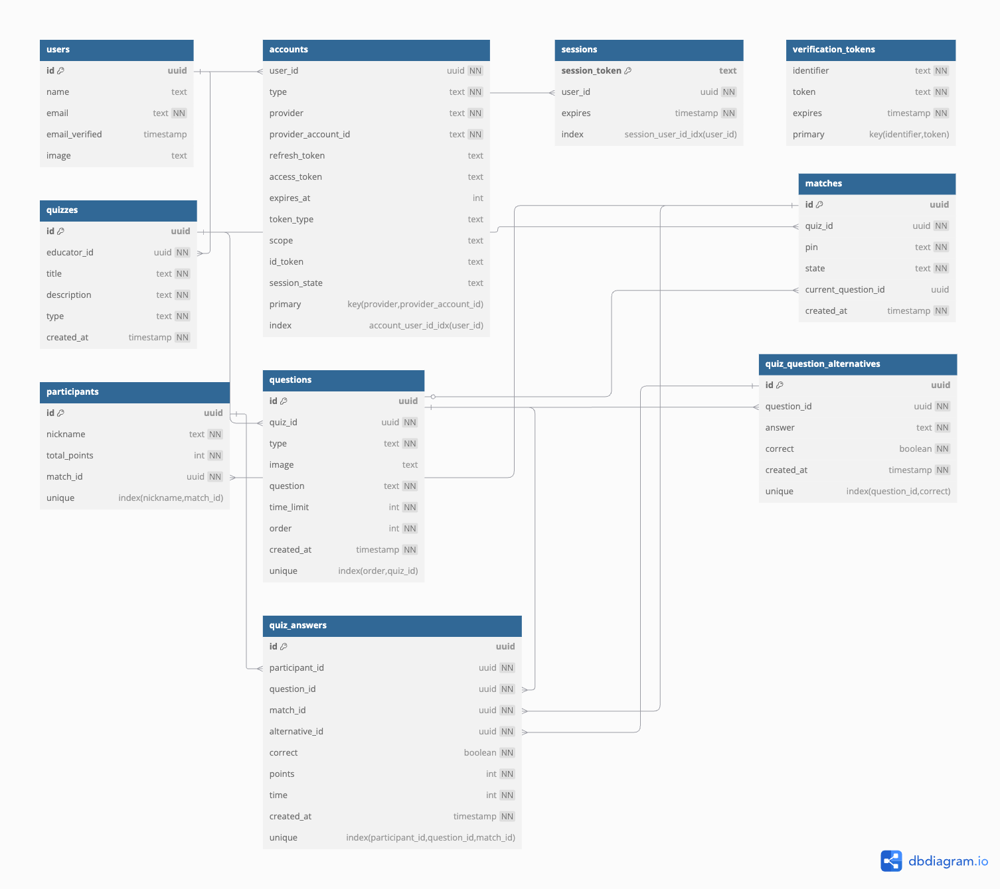

# MindRush

**Arthur Ferreira Costa, arthur.costa.1456541@sga.pucminas.br**

**Fernando Antônio Ferreira Ibrahim, 1443215@sga.pucminas.br**

**Jhonata Silveira Dias, jhonata.dias@sga.pucminas.br**

**Luca Ferrari Azalim, lazalim@pucminas.br**

**Pedro Henrique Braga de Castro, pcastro@sga.pucminas.br**

**Wanessa Dias Costa, wanessa.costa@sga.pucminas.br**

---

Professores:

**Cleiton Silva Tavares**

**Cristiano de Macêdo Neto**

**Hugo Bastos de Paula**

---

_Curso de Engenharia de Software, Campus Lourdes_

_Instituto de Informática e Ciências Exatas – Pontifícia Universidade de Minas Gerais (PUC MINAS), Belo Horizonte – MG – Brasil_

---

_**Resumo**. A plataforma MindRush está inserida no contexto de ferramentas de aprendizado baseadas em gamificação, voltadas para a dinamização do processo de ensino-aprendizagem por meio de quizzes interativos. A solução é destinada a educadores que desejam criar e aplicar quizzes personalizados em tempo real, permitindo a participação síncrona dos estudantes e fornecendo feedback imediato sobre seu desempenho. Inspirada em plataformas como Kahoot!, a ferramenta busca aprimorar a experiência educacional por meio de funcionalidades como rankings dinâmicos, geração automática de quizzes utilizando inteligência artificial generativa e um ambiente interativo que favorece o engajamento dos estudantes. Além disso, a solução incorpora mecanismos de aprendizado adaptativo e interações em tempo real, proporcionando uma experiência mais imersiva e motivadora._

---

## SUMÁRIO

1. [Apresentação](#apresentacao "Apresentação")  
   1.1. Problema  
   1.2. Objetivos do trabalho  
   1.3. Definições e Abreviaturas  

2. [Nosso Produto](#produto "Nosso Produto")  
   2.1. Visão do Produto  
   2.2. Nosso Produto  
   2.3. Personas  

3. [Requisitos](#requisitos "Requisitos")  
   3.1. Requisitos Funcionais  
   3.2. Requisitos Não-Funcionais  
   3.3. Restrições Arquiteturais  
   3.4. Mecanismos Arquiteturais  

4. [Modelagem](#modelagem "Modelagem e projeto arquitetural")  
   4.1. Visão de Negócio  
   4.2. Visão Lógica  
   4.3. Modelo de dados (opcional)  

5. [Wireframes](#wireframes "Wireframes")  

6. [Solução](#solucao "Projeto da Solução")  

7. [Avaliação](#avaliacao "Avaliação da Arquitetura")  
   7.1. Cenários  
   7.2. Avaliação  

8. [Referências](#referencias "REFERÊNCIAS") 

9. [Apêndices](#apendices "APÊNDICES") 
   9.1 Ferramentas  

# 1. Apresentação

O ensino tradicional enfrenta desafios no engajamento dos estudantes e na avaliação do aprendizado. Métodos convencionais, como aulas expositivas e provas escritas, nem sempre incentivam a participação ativa, tornando difícil identificar dificuldades em tempo real.

Plataformas de gamificação, como o Kahoot!, ajudam a melhorar o desempenho dos estudantes e a tornar as aulas mais dinâmicas (Wang e Tahir, 2020). No entanto, ainda há limitações, como problemas técnicos, pressão do tempo e dificuldades de adaptação.

Nesse contexto, o MindRush propõe uma plataforma de quizzes interativos que permite aos educadores criar e aplicar perguntas personalizadas em tempo real, possibilitando a participação síncrona dos estudantes e fornecendo feedback imediato. Além das funcionalidades tradicionais, a ferramenta também inclui rankings dinâmicos, geração automática de quizzes por inteligência artificial e recursos de aprendizado adaptativo, proporcionando uma experiência mais imersiva para professores e estudantes.

## 1.1. Problema

O modelo tradicional de ensino apresenta limitações na forma como o aprendizado é conduzido e avaliado. Os principais desafios incluem:

- Falta de engajamento dos estudantes em metodologias convencionais.
- Dificuldade dos educadores em avaliar a compreensão dos estudantes em tempo real.
- Problemas técnicos e falta de flexibilidade em plataformas de gamificação existentes.
- Estresse dos estudantes com o tempo limitado de resposta e dificuldades para acompanhar os quizzes.

## 1.2. Objetivos do trabalho

**Objetivo:** Desenvolver uma plataforma digital que permita a educadores a criação e aplicação em tempo real de quizzes personalizados.

**Objetivos específicos:**

- Desenvolver uma plataforma web que permita ao educador o gerenciamento dos quizzes e das suas aplicações em tempo real.
- Desenvolver um aplicativo móvel que permita ao estudante responder aos quizzes em tempo real e obter _feedback_ sobre seu desempenho.

## 1.3. Definições e Abreviaturas

## 1.3. Definições e Abreviaturas

| **Termo / Sigla** | **Definição**                                                                                                                                    |
| ----------------- | ------------------------------------------------------------------------------------------------------------------------------------------------ |
| API               | Interface de Programação de Aplicações (_Application Programming Interface_). Conjunto de rotinas e padrões para integração de software.         |
| IA                | Inteligência Artificial. Área da ciência da computação dedicada à criação de sistemas capazes de simular inteligência humana.                    |
| REST              | Estilo arquitetural para comunicação entre sistemas distribuídos utilizando o protocolo HTTP.                                                    |
| CRUD              | Acrônimo para Create, Read, Update e Delete. Operações básicas de persistência em banco de dados.                                                |
| UI/UX             | Interface do Usuário e Experiência do Usuário (_User Interface_ / _User Experience_). Design focado na interação e experiência do usuário final. |
| QR Code           | Código de barras bidimensional que pode ser escaneado para fornecer acesso rápido a uma URL ou outra informação.                                 |
| API RESTful       | API que segue o estilo arquitetural REST, baseada em recursos e operações HTTP (GET, POST, PUT, DELETE).                                         |
| PostgreSQL        | Sistema gerenciador de banco de dados relacional de código aberto e altamente escalável.                                                         |
| Next.js           | Framework React para desenvolvimento de aplicações web com renderização híbrida (SSR, SSG e CSR).                                                |
| Flutter           | Framework da Google para desenvolvimento de aplicações móveis nativas para iOS e Android com uma única base de código.                           |
| RabbitMQ          | Sistema de mensageria open-source baseado no protocolo AMQP, utilizado para comunicação assíncrona entre serviços.                               |
| Render            | Plataforma de computação em nuvem utilizada para deploy de aplicações web e serviços backend.                                                    |

# 2. Nosso Produto

Está seção explora um pouco mais sobre o produto a ser desenvolvido.

## 2.1 Visão do Produto

O MindRush é uma plataforma de quizzes gamificados projetada para transformar o processo de ensino-aprendizagem, proporcionando uma experiência interativa e engajadora para educadores e estudantes. Destinada a educadores que buscam dinamizar suas aulas e avaliar o aprendizado de forma mais atrativa, a ferramenta permite a criação e aplicação de quizzes em tempo real, promovendo a participação ativa dos estudantes por meio de rankings, desafios e feedbacks instantâneos. Diferente de soluções tradicionais, como o Google Forms, que se limitam à coleta de respostas em formulários estáticos, o MindRush promove uma experiência lúdica e competitiva.

## 2.2 Nosso Produto

| É                                                                                                                                                                                                                                                                                                                                                                                       | NÃO É                                                                                                                                                                                                                                                                                            |
| :-------------------------------------------------------------------------------------------------------------------------------------------------------------------------------------------------------------------------------------------------------------------------------------------------------------------------------------------------------------------------------------- | :----------------------------------------------------------------------------------------------------------------------------------------------------------------------------------------------------------------------------------------------------------------------------------------------- |
| Uma plataforma de quizzes personalizados que permite uma experiência de jogo síncrona entre estudantes conectados na mesma sala, promovendo engajamento e aprendizado de forma interativa e dinâmica.                                                                                                                                                                                   | Uma plataforma para criação e aplicação de questionários e provas formais, como o Google Forms.                                                                                                                                                                                                  |
| **FAZ**                                                                                                                                                                                                                                                                                                                                                                                 | **NÃO FAZ**                                                                                                                                                                                                                                                                                      |
| <ul><li>Traz gamificação ao ambiente escolar por meio da criação de salas onde os usuários competem entre si, testando seus conhecimentos sobre um determinado tema de forma interativa.</li><li>Possibilita a geração automática de quizzes com base em documentos fornecidos pelos usuários, utilizando IAs generativas para criar perguntas relevantes e contextualizadas.</li></ul> | <ul><li>Não permite a criação de provas ou formulários para avaliação individual</li><li>Não foca em ensino assíncrono ou aprendizado autodidata, exigindo interação síncrona entre usuários.</li><li>Não gera relatórios detalhados de desempenho para acompanhamento de longo prazo.</li></ul> |

## 2.3 Personas

<h2>Educadores</h2>
<table>
  <tr>
    <td style="vertical-align: top; width: 150px;">
      
    </td>
    <td style="vertical-align: top; padding-left: 10px;">
      <strong>Nome:</strong> Lucas Almeida  
      <strong>Idade:</strong> 43 anos  
      <strong>Hobby:</strong> Jogar xadrez e assistir documentários sobre ciência. 
      <strong>Trabalho:</strong> Professor de Engenharia de Software na PUC Minas. 
      <strong>Personalidade:</strong>  Analítico e um pouco tímido. Tem grande domínio técnico, mas encontra dificuldades para tornar suas aulas mais dinâmicas e envolventes. 
      <strong>Sonho:</strong> Ajudar seus estudantes a realmente se interessarem pelo conteúdo e aprenderem de forma significativa.  
      <strong>Dores:</strong>
	  	<ul>
	  		<li>Dificuldade em manter os estudantes concentrados e engajados nas aulas.</li>
	  		<li>Tempo limitado para preparar materiais interativos.</li>
		</ul>  
    </td>
  </tr>
</table>
<table>
  <tr>
    <td style="vertical-align: top; width: 150px;">
      
    </td>
    <td style="vertical-align: top; padding-left: 10px;">
      <strong>Nome:</strong> Carolina Mendes  
      <strong>Idade:</strong> 32 anos  
      <strong>Hobby:</strong> Gravar vídeos para seu canal educacional no YouTube e praticar yoga  
      <strong>Trabalho:</strong> Professora de Ciências da Computação na modalidade EAD  
      <strong>Personalidade:</strong>  Comunicativa, adaptável e inovadora. Sempre busca novas formas de engajar seus estudantes no ambiente digital, usando metodologias ativas e ferramentas interativas.  
      <strong>Sonho:</strong> Criar uma experiência de ensino online tão dinâmica e envolvente quanto as aulas presenciais, aumentando a taxa de aprendizado e participação dos estudantes. 
      <strong>Dores:</strong>
	  	<ul>
	  		<li>Percebe que muitos estudantes assistem às aulas de forma passiva e sem engajamento real</li>
	  		<li>Tem dificuldades em avaliar a compreensão dos estudantes de maneira eficaz no ambiente online</li>
        <li>Busca ferramentas que possibilitem interatividade e engajamento sem comprometer a organização do conteúdo</li>
		</ul>  
    </td>
  </tr>
</table>

<h2>Estudantes</h2>
<table>
  <tr>
    <td style="vertical-align: top; width: 150px;">
      
    </td>
    <td style="vertical-align: top; padding-left: 10px;">
      <strong>Nome:</strong> André Castro  
      <strong>Idade:</strong> 21 anos  
      <strong>Hobby:</strong> Jogar videogames e sair com os amigos  
      <strong>Trabalho:</strong> Estudante de Sistemas de Informação na PUC Minas. 
      <strong>Personalidade:</strong> Desligado, procrastinador e desmotivado com o curso. Ele se interessa por tecnologia, mas sente dificuldades em se concentrar nas disciplinas mais teóricas.. 
      <strong>Sonho:</strong> Concluir a faculdade e conseguir um emprego, mas ainda não sabe em qual área deseja atuar.  
	<strong>Dores:</strong>
	  	<ul>
	  		<li>Acha difícil manter o foco em aulas expositivas e frequentemente perde o interesse</li>
	  		<li>Tem dificuldades em acompanhar o conteúdo, especialmente em disciplinas que exigem mais lógica e raciocínio</li>
			<li>Precisa de estímulos externos para estudar e revisar o conteúdo antes das provas</li>
		</ul>  
    </td>
  </tr>
</table>
<table>
  <tr>
    <td style="vertical-align: top; width: 150px;">
      
    </td>
    <td style="vertical-align: top; padding-left: 10px;">
      <strong>Nome:</strong> Mariana Santos 
      <strong>Idade:</strong> 25 anos  
      <strong>Hobby:</strong> Participar de hackathons e consumir conteúdos sobre tecnologia  
      <strong>Trabalho:</strong> Estudante de Engenharia de Software e desenvolvedora júnior em uma startup de software  
      <strong>Personalidade:</strong> Focada, determinada e autodidata. Gosta de desafios e sempre busca aprender além do que é ensinado em sala de aula.  
      <strong>Sonho:</strong> Se tornar uma engenheira de software sênior e trabalhar em projetos inovadores no exterior. 
	<strong>Dores:</strong>
	  	<ul>
	  		<li>Sente que o ensino tradicional muitas vezes não acompanha a velocidade do mercado de tecnologia.</li>
	  		<li>Acha que algumas metodologias acadêmicas são ultrapassadas e pouco envolventes.</li>
			  <li>Busca formas de testar e aprimorar seus conhecimentos de maneira mais interativa e aplicada.</li>
		</ul>  
    </td>
  </tr>
</table>

# 3. Requisitos

Esta seção descreve os requisitos comtemplados nesta descrição arquitetural, divididos em dois grupos: funcionais e não funcionais.

## 3.1. Requisitos Funcionais

| **ID** | **Descrição**                                                                  | **Prioridade** | **Plataforma** |
| ------ | ------------------------------------------------------------------------------ | -------------- | -------------- |
| RF1    | O educador se cadastra no sistema.                                             | Essencial      | Web            |
| RF2    | O educador gerencia os quizzes.                                                | Essencial      | Web            |
| RF3    | O educador gera um quiz a partir de um tema qualquer usando IA generativa.     | Opcional       | Web            |
| RF4    | O educador gera um quiz a partir de um documento PDF usando IA generativa.     | Opcional       | Web            |
| RF5    | O educador gerencia as questões dos quizzes.                                   | Essencial      | Web            |
| RF6    | O educador gera uma partida a partir de um quiz.                               | Essencial      | Web            |
| RF7    | O educador inicia, pausa e encerra uma partida.                                | Essencial      | Web            |
| RF8    | O educador acompanha o andamento da partida.                                   | Desejável      | Web            |
| RF9    | O estudante informa um código para acessar uma partida.                        | Essencial      | Móvel          |
| RF10   | O estudante escaneia um código QR para acessar uma partida.                    | Opcional       | Móvel          |
| RF11   | O estudante informa um apelido que o identificará na partida.                  | Essencial      | Móvel          |
| RF12   | O estudante responde às questões da partida em tempo real.                     | Essencial      | Móvel          |
| RF13   | O estudante visualiza o ranque de pontuação da partida ao fim de cada questão. | Desejável      | Móvel          |
| RF14   | O estudante visualiza o ranque de pontuação final ao fim da partida.           | Desejável      | Móvel          |

**Observação:** as colunas "Sprint" e "Status" foram removidas, uma vez que o planejamento e o estado de conclusão de cada requisito estão sendo controlados por meio do [GitHub Projects](https://github.com/orgs/ICEI-PUC-Minas-PPLES-TI/projects/556).

## 3.2. Requisitos Não-Funcionais

| **ID** | **Descrição**                                                                                                                                                                                                                                                                                                      |
| ------ | ------------------------------------------------------------------------------------------------------------------------------------------------------------------------------------------------------------------------------------------------------------------------------------------------------------------ |
| RNF1   | O sistema deve ser compatível com os navegadores web Google Chrome (v134), Mozilla Firefox (v135), Microsoft Edge (v133) e Safari (v18.3).                                                                                                                                                                         |
| RNF2   | A interface do front-end web deve ser compatível e oferecer responsividade para telas entre 1280 e 1920 pixels de largura.                                                                                                                                                                                         |
| RNF3   | A interface do front-end web deve estar disponível nos modos claro, escuro e sistema.                                                                                                                                                                                                                              |
| RNF4   | O desenvolvimento do back-end deve adotar o padrão REST para estruturação da API, atendendo ao nível 2 do modelo de maturidade de Richardson.                                                                                                                                                                      |
| RNF5   | O sistema deve exigir, dos educadores, autenticação com uma conta Google.                                                                                                                                                                                                                                          |
| RNF6   | O sistema deve usar a abordagem _Session Based Authentication_, armazenando as sessões dos usuários em banco de dados.                                                                                                                                                                                             |
| RNF7   | As respostas dos estudantes aos quizzes devem ser vinculadas exclusivamente ao nome de usuário escolhido por eles ao início de cada partida, impedindo a identificação direta dos participantes por meio de informações pessoais, garantindo o anonimato e a privacidade dos jogadores durante e após a atividade. |
| RNF8   | O sistema deve suportar até 60 estudantes participando de um quiz ao mesmo tempo, sem aumento significativo de tempo de resposta.                                                                                                                                                                                  |
| RNF9   | O tempo de processamento das requisições realizadas à API deve ser inferior a 200ms, considerando apenas o tempo de execução no servidor e desconsiderando a latência da rede.                                                                                                                                     |
| RNF10  | O sistema não pode apresentar a falha de segurança "quebra de controle de acesso".                                                                                                                                                                                                                                 |
| RNF11  | O sistema não pode apresentar a falha de segurança "falhas de criptografia".                                                                                                                                                                                                                                       |
| RNF12  | O sistema não pode apresentar a falha de segurança "injeção"                                                                                                                                                                                                                                                       |

## 3.3. Restrições Arquiteturais

As restrições arquiteturais do projeto são as seguintes:

- O sistema deve adotar um modelo baseado em web service.
- Deve oferecer suporte a serviços tanto no ambiente web quanto no móvel.
- As versões web e móvel devem ser desenvolvidas utilizando tecnologias distintas.
- Deve incluir um mecanismo de comunicação em tempo real (mensageria).
- Deve utilizar serviços de computação em nuvem.
- A hospedagem deve ser realizada em uma plataforma de nuvem gratuita.
- Estratégias de testes devem ser implementadas para garantir a qualidade do sistema.
- O sistema deve permitir que múltiplos clientes se conectem simultaneamente a um único servidor, possibilitando operações concorrentes.

## 3.4. Mecanismos Arquiteturais

Os mecanismos arquiteturais do MindRush foram definidos para garantir desempenho, escalabilidade e segurança. A tabela abaixo resume as principais escolhas tecnológicas:

| **Análise**       | **Design**                            | **Implementação**                         |
| ----------------- | ------------------------------------- | ----------------------------------------- |
| Persistência      | Banco de Dados Relacional + ORM       | PostgreSQL + Drizzle                      |
| Back-end          | REST API + RPC                        | Route Handlers + Server Actions (Next.js) |
| Front-end         | Single Page Application               | React + Next.js                           |
| Aplicativo        | Tecnologia híbrida para iOS e Android | Flutter                                   |
| Mensageria        | Event driven                          | RabbitMQ                                  |
| Teste de Software | Testes unitários e de integração      | Jest                                      |
| Deploy            | Cloud gerenciado                      | Render                                    |

# 4. Modelagem e Projeto Arquitetural

A Figura 1 apresenta uma visão geral da solução proposta, ilustrando a macroarquitetura do projeto.

**Figura 1 - Visão geral da solução. Fonte: o próprio autor.**

Breve descrição do diagrama:

- **Usuários**: O educador cria e gerencia quizzes, enquanto o estudante participa das partidas.
- **Front-end**: Interface web (Next.js) para educadores e aplicativo móvel (Flutter) para estudantes.
- **Back-end**: Next.js API centraliza a lógica, com serviços modulares para autenticação, quizzes e partidas.
- **Infraestrutura**: PostgreSQL armazena dados, RabbitMQ gerencia mensagens e API de IA Generativa gera quizzes automaticamente.
- **Fluxo**: O Front-end consome a API, que interage com o banco de dados, mensageria e IA para entregar uma experiência dinâmica e escalável.

## 4.1. Visão de Negócio (Funcionalidades)

1. **Cadastro e Autenticação**

   - O educador pode criar uma conta no sistema.
   - O educador pode realizar login para acessar suas funcionalidades.

2. **Gerenciamento de Quizzes**

   - O educador pode editar e excluir quizzes existentes.
   - O educador pode criar quizzes personalizados, criando-os a partir do zero ou usando IA generativa.

3. **Gerenciamento de Questões**

   - O educador pode adicionar, editar e remover questões em um quiz.

4. **Execução de Quizzes**

   - O educador pode iniciar uma partida de quiz.
   - O educador pode pausar e encerrar a partida a qualquer momento.
   - O educador pode visualizar o andamento da partida e o desempenho dos estudantes.

5. **Participação dos Estudantes**

   - O estudante pode entrar em uma partida informando um código único.
   - O estudante pode escanear um QR Code para acessar a partida de forma rápida.
   - O estudante pode inserir seu nome antes de participar.
   - O estudante pode responder perguntas em tempo real.

6. **Interatividade e Feedback**
   - O sistema exibe o ranking dos participantes ao final de cada pergunta.
   - O sistema exibe o ranking final ao término da partida.
   - O estudante recebe feedback imediato sobre suas respostas.

### Histórias de Usuário

A seguir, são apresentadas as histórias de usuário para o **MindRush**, estruturadas conforme as necessidades de educadores e estudantes.

| **EU COMO...** | **QUERO/PRECISO...**                                       | **PARA QUE...**                                        |
| -------------- | ---------------------------------------------------------- | ------------------------------------------------------ |
| **Educador**   | Criar quizzes personalizados                               | Avaliar o aprendizado dos estudantes de forma dinâmica |
| **Educador**   | Gerar quizzes automaticamente com IA generativa            | Economizar tempo na criação de perguntas               |
| **Educador**   | Iniciar, pausar e encerrar uma partida de quiz             | Controlar o ritmo da atividade em sala de aula         |
| **Educador**   | Acompanhar o progresso dos estudantes durante o quiz       | Identificar dificuldades em tempo real                 |
| **Educador**   | Visualizar o ranking dos participantes ao final da partida | Estimular o engajamento dos estudantes                 |
| **Educador**   | Compartilhar um código para os estudantes entrarem no quiz | Facilitar o acesso e participação na atividade         |
| **Estudante**  | Inserir um código e entrar na partida                      | Participar do quiz de forma interativa                 |
| **Estudante**  | Responder perguntas em tempo real                          | Testar meus conhecimentos e aprender de forma ativa    |
| **Estudante**  | Visualizar minha posição no ranking                        | Acompanhar meu desempenho e competir de forma saudável |
| **Estudante**  | Receber feedback imediato sobre minhas respostas           | Saber se estou acertando ou errando as questões        |
| **Estudante**  | Escanear um QR Code para entrar rapidamente na partida     | Facilitar o acesso ao quiz sem digitar códigos         |

## 4.2. Visão Lógica

Esta seção apresenta os artefatos que foram utilizados para projetar o sistema.

### Diagrama de Classes

O **diagrama de classes** foi utilizado para modelar a estrutura estática do sistema, representando as entidades principais, seus atributos e relacionamentos. Ele permite visualizar como os **educadores, quizzes, partidas e respostas** interagem, garantindo um design coerente e alinhado aos requisitos funcionais e não funcionais. Além disso, a herança aplicada às questões (múltipla escolha e verdadeiro/falso) favorece a extensibilidade e a reutilização de código.

**Figura 2 – Diagrama de classes. Fonte: o próprio autor.**

### Diagrama de componentes

O **diagrama de componentes** foi empregado para representar a arquitetura do sistema, destacando **módulos, interfaces e suas interações**. Ele evidencia a separação entre **Front-end (Web e Mobile), Back-end (API), Banco de Dados e Mensageria**, garantindo uma visão clara da comunicação entre os serviços. Esse modelo modular facilita a escalabilidade, manutenção e implementação de novas funcionalidades.

**Figura 3 – Diagrama de componentes. Fonte: o próprio autor.**

#### Estilos/Padrões Arquiteturais Utilizados

1. **Arquitetura Cliente-Servidor**: O **Front-end Web (Next.js)** e o **Aplicativo Flutter** se comunicam com o **Back-end (Next.js API)** via **REST API**.
2. **Arquitetura em Camadas**: Separação entre **interface do usuário, lógica de negócio e persistência**.
3. **RESTful API**: O Back-end expõe **serviços HTTP** para os clientes consumirem.
4. **Event-Driven Architecture (EDA)**: **RabbitMQ** gerencia eventos de **partidas e atualizações em tempo real**.
5. **Cross-Platform**: **Flutter** garante compatibilidade para Android e iOS.

---

#### Descrição Sucinta dos Componentes

| **Componente**       | **Papel dentro da Arquitetura**                                                                               |
| -------------------- | ------------------------------------------------------------------------------------------------------------- |
| **Educador**         | Cria e gerencia quizzes, aplica partidas e acompanha o desempenho dos estudantes via navegador.               |
| **Estudante**        | Participa das partidas e responde às perguntas em tempo real pelo aplicativo móvel.                           |
| **Navegador**        | Interface web (Next.js) utilizada pelos educadores para gerenciar quizzes e partidas.                         |
| **Aplicativo**       | Aplicativo Flutter utilizado pelos estudantes para interagir com as partidas gamificadas.                     |
| **Server Actions**   | Executa ações críticas no servidor, como controle da lógica de negócios das partidas.                         |
| **React Components** | Componentes da interface web utilizados na plataforma do educador.                                            |
| **REST API**         | Disponibiliza serviços HTTP consumidos pelo aplicativo, como autenticação e envio de respostas.               |
| **WebSocket**        | Proporciona comunicação em tempo real entre o back-end e o aplicativo, enviando atualizações instantâneas.    |
| **Banco de Dados**   | Armazena dados relacionados a usuários, quizzes, partidas e resultados (PostgreSQL).                          |
| **Mensageria**       | Gerencia eventos e filas de comunicação assíncrona entre os serviços (RabbitMQ).                              |
| **API da OpenAI**    | Serviço externo que gera quizzes automaticamente a partir de temas ou documentos fornecidos pelos educadores. |

---

#### Classificação dos Componentes

| **Tipo**          | **Componentes**                                                                 |
| ----------------- | ------------------------------------------------------------------------------- |
| **Reutilizados**  | Navegadores, PostgreSQL, RabbitMQ.                                              |
| **Adquiridos**    | API de IA Generativa (serviço externo, possivelmente pago).                     |
| **Desenvolvidos** | Next.js (Front-end e Back-end), Aplicativo Flutter, Serviços de Quiz e Partida. |

## 4.3. Modelo de dados

O diagrama da Figura 4 representa o modelo de dados do sistema.

- A **tabela `educator`** armazena os dados dos educadores responsáveis pela criação dos quizzes, incluindo informações como nome e e-mail.
- A **tabela `quiz`** contém os quizzes criados pelos educadores, com campos para título, descrição e data de criação, além da relação com o educador responsável.
- A **tabela `question`** guarda as perguntas dos quizzes, com informações como o tipo da pergunta (múltipla escolha ou verdadeiro/falso), o texto da pergunta e o limite de tempo.
- A **tabela `question_quiz_alternatives`** registra as alternativas das perguntas do tipo múltipla escolha, identificando qual alternativa é a correta.
- A **tabela `match`** representa as sessões (ou partidas) de execução dos quizzes, contendo o código PIN da partida e o estado atual (aguardando, em execução, pausada ou finalizada).
- A **tabela `participant`** armazena os participantes que ingressaram em uma partida, identificados pelo apelido e pelo vínculo com a partida específica.
- A **tabela `quiz_answer`** registra as respostas dos participantes para cada pergunta de uma determinada partida, garantindo que cada combinação de participante, pergunta e partida seja única.

As relações entre as tabelas foram estabelecidas para garantir a integridade referencial do sistema, permitindo o rastreamento de todas as etapas, desde a criação do quiz até a participação e resposta dos jogadores em uma partida específica.

**Figura 4 – Diagrama Lógico de Banco de Dados. Fonte: o próprio autor.**

# 5. Wireframes

## Wireframe Mobile
### Tela de início.

### RF9: O estudante informa um código para acessar uma partida.

### RF11: O estudante informa um apelido que o identificará na partida.

### Lobby de espera.

### Carregamento da partida.

### Exibição da pergunta.

### RF12: O estudante responde às questões da partida em tempo real. (Múltipla escolha)

### Resposta correta.

### Resposta errada.

### RF12: O estudante responde às questões da partida em tempo real. (Verdadeiro ou falso)

### Resposta correta. (Verdadeiro ou falso)

### Resposta errada. (Verdadeiro ou falso)

## Wireframe Web
### RF2: O educador gerencia os quizzes.

#### Modal para criar um quiz.

#### Step para quizzes gerados por IA.

#### Step para quizzes gerados por PDF.

### RF5: O educador gerencia as questões dos quizzes.

### RF6: O educador gera uma partida a partir de um quiz.

# 6. Projeto da Solução

_Apresente as telas dos sistema construído com uma descrição sucinta de cada uma das interfaces._

# 7. Avaliação da Arquitetura

_Esta seção descreve a avaliação da arquitetura apresentada, baseada no método ATAM._

## 7.1. Cenários

_Apresente os cenários de testes utilizados na realização dos testes da sua aplicação. Escolha cenários de testes que demonstrem os requisitos não funcionais sendo satisfeitos. Os requisitos a seguir são apenas exemplos de possíveis requisitos, devendo ser revistos, adequados a cada projeto e complementados de forma a terem uma especificação completa e auto-explicativa._

**Cenário 1 - Acessibilidade:** Suspendisse consequat consectetur velit. Sed sem risus, dictum dictum facilisis vitae, commodo quis leo. Vivamus nulla sem, cursus a mollis quis, interdum at nulla. Nullam dictum congue mauris. Praesent nec nisi hendrerit, ullamcorper tortor non, rutrum sem. In non lectus tortor. Nulla vel tincidunt eros.

**Cenário 2 - Interoperabilidade:** Pellentesque habitant morbi tristique senectus et netus et malesuada fames ac turpis egestas. Fusce ut accumsan erat. Pellentesque in enim tempus, iaculis sem in, semper arcu.

**Cenário 3 - Manutenibilidade:** Phasellus magna tellus, consectetur quis scelerisque eget, ultricies eu ligula. Sed rhoncus fermentum nisi, a ullamcorper leo fringilla id. Nulla lacinia sem vel magna ornare, non tincidunt ipsum rhoncus. Nam euismod semper ante id tristique. Mauris vel elit augue.

**Cenário 4 - Segurança:** Suspendisse consectetur porta tortor non convallis. Sed lobortis erat sed dignissim dignissim. Nunc eleifend elit et aliquet imperdiet. Ut eu quam at lacus tincidunt fringilla eget maximus metus. Praesent finibus, sapien eget molestie porta, neque turpis congue risus, vel porttitor sapien tortor ac nulla. Aliquam erat volutpat.

## 7.2. Avaliação

_Apresente as medidas registradas na coleta de dados. O que não for possível quantificar apresente uma justificativa baseada em evidências qualitativas que suportam o atendimento do requisito não-funcional. Apresente uma avaliação geral da arquitetura indicando os pontos fortes e as limitações da arquitetura proposta._

| **Atributo de Qualidade:** | Segurança                                                                                                                                                                                                                                                              |
| -------------------------- | ---------------------------------------------------------------------------------------------------------------------------------------------------------------------------------------------------------------------------------------------------------------------- |
| **Requisito de Qualidade** | Acesso aos recursos restritos deve ser controlado                                                                                                                                                                                                                      |
| **Preocupação:**           | Os acessos de usuários devem ser controlados de forma que cada um tenha acesso apenas aos recursos condizentes as suas credenciais.                                                                                                                                    |
| **Cenários(s):**           | Cenário 4                                                                                                                                                                                                                                                              |
| **Ambiente:**              | Sistema em operação normal                                                                                                                                                                                                                                             |
| **Estímulo:**              | Acesso do administrador do sistema as funcionalidades de cadastro de novos produtos e exclusão de produtos.                                                                                                                                                            |
| **Mecanismo:**             | O servidor de aplicação (Rails) gera um _token_ de acesso para o usuário que se autentica no sistema. Este _token_ é transferido para a camada de visualização (Angular) após a autenticação e o tratamento visual das funcionalidades podem ser tratados neste nível. |
| **Medida de Resposta:**    | As áreas restritas do sistema devem ser disponibilizadas apenas quando há o acesso de usuários credenciados.                                                                                                                                                           |

**Considerações sobre a arquitetura:**

| **Riscos:**                  | Não existe |
| ---------------------------- | ---------- |
| **Pontos de Sensibilidade:** | Não existe |
| _ **Tradeoff** _ **:**       | Não existe |

Evidências dos testes realizados

_Apresente imagens, descreva os testes de tal forma que se comprove a realização da avaliação._

# 8. REFERÊNCIAS

_Como um projeto da arquitetura de uma aplicação não requer revisão bibliográfica, a inclusão das referências não é obrigatória. No entanto, caso você deseje incluir referências relacionadas às tecnologias, padrões, ou metodologias que serão usadas no seu trabalho, relacione-as de acordo com a ABNT._

Verifique no link abaixo como devem ser as referências no padrão ABNT:

http://www.pucminas.br/imagedb/documento/DOC\_DSC\_NOME\_ARQUI20160217102425.pdf

**[1]** - _ELMASRI, Ramez; NAVATHE, Sham. **Sistemas de banco de dados**. 7. ed. São Paulo: Pearson, c2019. E-book. ISBN 9788543025001._

**[2]** - _COPPIN, Ben. **Inteligência artificial**. Rio de Janeiro, RJ: LTC, c2010. E-book. ISBN 978-85-216-2936-8._

**[3]** - _CORMEN, Thomas H. et al. **Algoritmos: teoria e prática**. Rio de Janeiro, RJ: Elsevier, Campus, c2012. xvi, 926 p. ISBN 9788535236996._

**[4]** - _SUTHERLAND, Jeffrey Victor. **Scrum: a arte de fazer o dobro do trabalho na metade do tempo**. 2. ed. rev. São Paulo, SP: Leya, 2016. 236, [4] p. ISBN 9788544104514._

**[5]** - _RUSSELL, Stuart J.; NORVIG, Peter. **Inteligência artificial**. Rio de Janeiro: Elsevier, c2013. xxi, 988 p. ISBN 9788535237016._

# 9. APÊNDICES

_Inclua o URL do repositório (Github, Bitbucket, etc) onde você armazenou o código da sua prova de conceito/protótipo arquitetural da aplicação como anexos. A inclusão da URL desse repositório de código servirá como base para garantir a autenticidade dos trabalhos._

## 9.1 Ferramentas

| Ambiente              | Plataforma        | Link de Acesso                |
| --------------------- | ----------------- | ----------------------------- |
| Repositório de código | GitHub            | https://github.com/XXXXXXX    |
| Hospedagem do site    | Heroku            | https://XXXXXXX.herokuapp.com |
| Protótipo Interativo  |  Figma | https://encr.pw/l4sVl     |
| Documentação de teste | Github            | https://githun.com/xxxx       |
