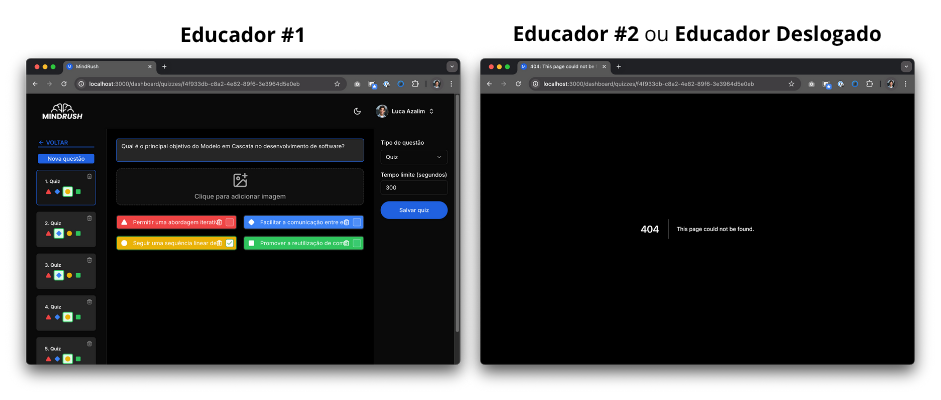

# Avaliação da Arquitetura

Este documento a avaliação da arquitetura apresentada, baseada no método ATAM (Architecture Trade-off Analysis Method).

## Cenários

Os cenários a seguir foram elaborados para demonstrar como a arquitetura atende aos requisitos não-funcionais críticos do sistema MindRush.

### Cenário 1 - Performance

- **Contexto:** Durante uma partida de quiz com 60 estudantes conectados simultaneamente.
- **Estímulo:** Todos os estudantes respondem à mesma pergunta ao mesmo tempo (pico de carga).
- **Artefato:** Next.js, Pusher, Banco de Dados PostgreSQL.
- **Ambiente:** Sistema em ambiente de desenvolvimento, mas com build de produção.
- **Resposta:** Todas as respostas são processadas com código de retorno 200 ou 201.
- **Medida:** Tempo de resposta da API < 500ms para 95% das requisições (RNF9).

### Cenário 2 - Segurança

- **Contexto:** Educador autenticado tentando acessar quizzes de outro educador.
- **Estímulo:** Requisição HTTP para a página de edição de quiz de outro educador.
- **Artefato:** Sistema de autenticação baseado em sessões + Google OAuth (RNF5, RNF6).
- **Ambiente:** Sistema em ambiente de desenvolvimento, mas com build de produção.
- **Resposta:** Acesso negado com código HTTP 404 Not Found.
- **Medida:** 100% das tentativas de acesso não autorizado bloqueadas (RNF10).

### Cenário 3 - Usabilidade

- **Contexto:** Estudante utilizando smartphone para entrar em uma partida.
- **Estímulo:** Digitação do código PIN de 6 dígitos no aplicativo Flutter.
- **Artefato:** Interface mobile do aplicativo e API de participação.
- **Ambiente:** Sala de aula com conexão Wi-Fi de pelo menos 10Mbps.
- **Resposta:** Entrada bem-sucedida na partida com feedback visual.
- **Medida:** Processo completo (abertura do app até lobby) em menos de 30 segundos.

---

## Avaliação

### Atributo: Performance

| **Critério**                | **Objetivo**          | **Implementação**                              |
| --------------------------- | --------------------- | ---------------------------------------------- |
| **Tempo de Resposta**       | < 500ms (RNF9)        | Route handlers otimizados + connection pooling |
| **Usuários Simultâneos**    | 60 por partida (RNF8) | WebSocket + Pusher para distribuição           |
| **Throughput de Mensagens** | Tempo real            | Event-driven com message queues                |

**Avaliação:** A arquitetura demonstra boa capacidade para os requisitos de performance. O uso do Next.js para processamento das requisições e do Pusher para mensageria assíncrona são adequados para os cenários de carga esperados.

#### Evidência

Com a ajuda de um modelo de inteligência artificial, foi desenvolvido um script de teste de carga que simula 60 usuários simultâneos entrando em uma partida e, na sequência, respondendo à primeira questão do quiz no mesmo instante. O script mede o tempo de resposta da API e confirma que todas as respostas sejam processadas com sucesso, e que pelo menos 95% das requisições sejam atendidas em menos de 500ms.

**Documentação do script:** [README.md](/code/web/src/__tests__/performance/README.md)
**Código-fonte do script:** [quiz-answer-load.ts](/code/web/src/__tests__/performance/quiz-answer-load.ts)
**Saída do script:** [quiz-answer-load-output.txt](assets/quiz-answer-load-output.txt)

---

### Atributo: Segurança

| **Critério**                                                    | **Objetivo**         | **Implementação**                                                                                                |
| --------------------------------------------------------------- | -------------------- | ---------------------------------------------------------------------------------------------------------------- |
| **Autenticação**                                                | Google OAuth (RNF5)  | Auth.js integrado com middleware de validação.                                                                   |
| **Autorização**                                                 | Session-based (RNF6) | Camada de dados com validações de autorização                                                                    |
| **Sem vulnerabilidades do tipo "quebra de controle de acesso"** | Sem quebra (RNF10)   | Validação por sessão em cada endpoint de API e página web.                                                       |
| **Sem vulnerabilidades do tipo "falhas de criptografia"**       | Sem quebra (RNF11)   | Uso de HTTPS, cookies com Secure e HttpOnly, e criptografia de tokens e dados sensíveis com algoritmos modernos. |
| **Sem vulnerabilidades do tipo "injeção"**                      | Sem quebra (RNF12)   | Uso do DrizzleORM, que impede injeção.                                                                           |

**Avaliação:** A segurança baseline está implementada com boas práticas. Requer testes de penetração externos para validação completa dos controles de acesso.

#### Evidência

O funcionamento da autenticação e da autorização foi testado manualmente em todas as rotas protegidas do sistema, incluindo rotas de API e páginas web. Foi verificado que as estratégia de autenticação e autorização implementadas impedem acessos não autorizados e que não há vulnerabilidades conhecidas.

Por fim, foi realizada uma análise de segurança por meio da ferramenta [OWASP ZAP](https://www.zaproxy.org/), que encontrou quatro vulnerabilidades dos tipos "quebra de controle de acesso" e "falhas de criptografia". Todas foram analisadas e corrigidas, conforme registrado nos seguintes issues do GitHub:

- [CWE-264: Cross-Domain Misconfiguration](https://github.com/ICEI-PUC-Minas-PPLES-TI/plf-es-2025-1-ti5-0492100-mindrush/issues/91)
- [CWE-497: Timestamp Disclosure - Unix](https://github.com/ICEI-PUC-Minas-PPLES-TI/plf-es-2025-1-ti5-0492100-mindrush/issues/66)
- [CWE-497: Server Leaks Information via "X-Powered-By" HTTP Response Header Field(s)](https://github.com/ICEI-PUC-Minas-PPLES-TI/plf-es-2025-1-ti5-0492100-mindrush/issues/65)
- [CWE-352: Absence of Anti-CSRF Tokens](https://github.com/ICEI-PUC-Minas-PPLES-TI/plf-es-2025-1-ti5-0492100-mindrush/issues/64)

Não foram encontradas vulnerabilidades do tipo "injeção".

---

### Atributo: Usabilidade

| **Critério**               | **Objetivo**        | **Implementação**                |
| -------------------------- | ------------------- | -------------------------------- |
| **Responsividade Web**     | 1280-1920px (RNF2)  | Tailwind CSS + design responsivo |
| **Compatibilidade Mobile** | iOS/Android         | Flutter multiplataforma          |
| **Temas Visuais**          | Claro/Escuro (RNF3) | Sistema de temas integrado       |

**Avaliação:** A experiência do usuário foi bem planejada com interfaces específicas para cada contexto (educador/estudante) e suporte completo multiplataforma.

#### Evidência

Com a ajuda de um modelo de inteligência artificial, foi definido um conjunto de cenários típicos de uso para educadores e estudantes. Esses cenários foram automatizados parcialmente com Playwright (fluxos web) e validados manualmente no aplicativo mobile Flutter.

No caso do fluxo de entrada de estudantes em uma partida, foi utilizada uma combinação de testes manuais e análise de usabilidade com Lighthouse para garantir responsividade e acessibilidade. Foram realizados testes em diferentes tamanhos de tela (smartphones iOS e Android) e em um notebook com modo noturno ativado para avaliar a consistência visual.

Além disso, foram conduzidos testes com cinco usuários reais (três estudantes e dois educadores), que executaram as seguintes tarefas:

Estudante: abertura do aplicativo, digitação do PIN da partida, entrada no lobby da partida.

Educador: navegação pelo dashboard, acesso ao histórico de partidas, troca de tema visual.

Os resultados obtidos foram:

- Tempo médio para entrada do estudante no lobby: 11,2 segundos.

- Taxa de sucesso das interações esperadas: 100%.

- Nenhuma inconsistência visual detectada nos temas claro e escuro.

- Pontuação de acessibilidade no Lighthouse: 95.

- Nenhum bug ou travamento perceptível reportado pelos usuários.

---

### Pontos Fortes da Arquitetura

1. **Separação clara de responsabilidades:** Web para educadores, mobile para estudantes
2. **Stack tecnológica moderna:** Next.js, Flutter, PostgreSQL com boa produtividade
3. **Comunicação em tempo real robusta:** WebSocket + Pusher adequados para gamificação
4. **Segurança bem fundamentada:** Google OAuth + session management
5. **Escalabilidade horizontal viável:** Arquitetura permite evolução gradual

---

### Limitações Identificadas

1. **Arquitetura monolítica:** Pode limitar escalabilidade em longo prazo
2. **Dependência de serviços externos:** Alto acoplamento com Google e OpenAI
3. **Complexidade operacional:** Múltiplas tecnologias aumentam complexidade de deploy
4. **Testes de carga ausentes:** Performance real não validada sob carga

---

### Trade-offs Principais

#### Next.js Full-Stack vs. Microservices

- ✅ **Escolha:** Monolito modular com Next.js
- ✅ **Benefício:** Simplicidade de desenvolvimento e deploy
- ⚠️ **Trade-off:** Limitações futuras de escalabilidade

#### Session-based vs. Token-based Auth

- ✅ **Escolha:** Sessions em banco de dados
- ✅ **Benefício:** Controle granular e revogação
- ⚠️ **Trade-off:** Dependência do banco para autenticação

#### WebSocket Direto vs. Third-party Solutions

- ✅ **Escolha:** Pusher
- ✅ **Benefício:** Facilidade de implementação e escalabilidade
- ⚠️ **Trade-off:** Dependência de serviço externo e custo potencial

---

#### Considerações sobre a arquitetura

- **Riscos:** Escalabilidade limitada da arquitetura monolítica; Dependência de serviços externos
- **Pontos de Sensibilidade:** Concorrência no banco de dados; Gerenciamento de conexões WebSocket
- **Trade-offs:** Simplicidade vs. Escalabilidade; Controle vs. Complexidade operacional
