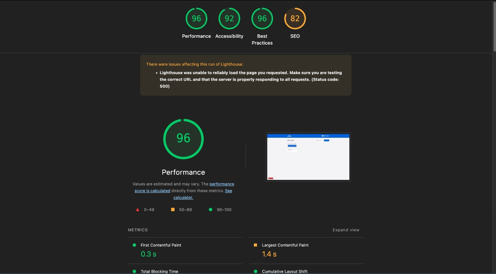
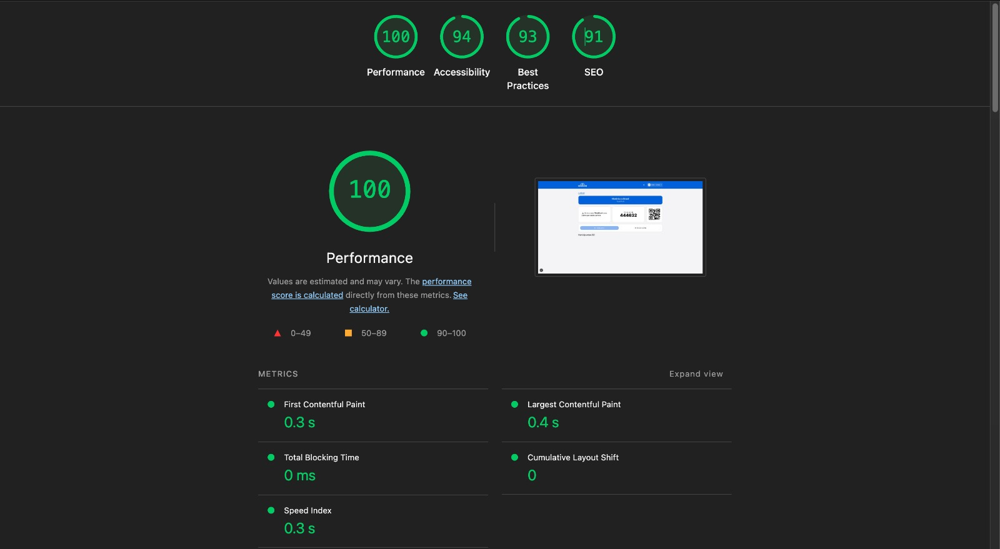
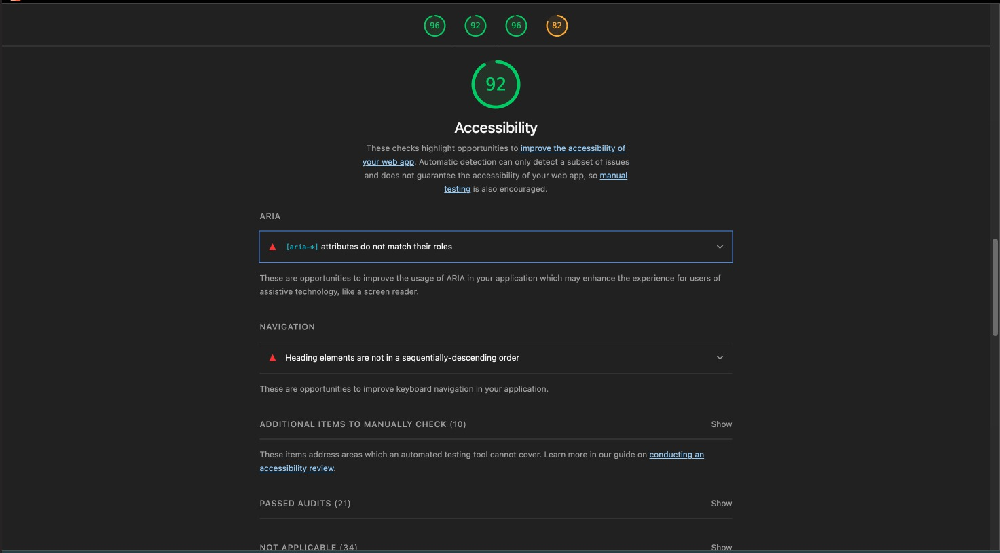
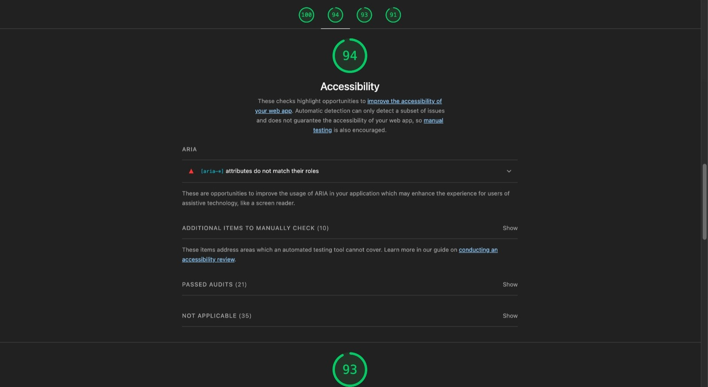

# Architecture Evaluation

This document contains the evaluation of the presented architecture, based on the ATAM (Architecture Trade-off Analysis Method) method.

## Scenarios

The following scenarios were developed to demonstrate how the architecture meets the critical non-functional requirements of the MindRush system.

### Scenario 1 - Performance

- **Context:** During a quiz game with 60 students connected simultaneously.
- **Stimulus:** All students answer the same question at the same time (peak load).
- **Artifact:** Next.js, Pusher, PostgreSQL Database.
- **Environment:** System in development environment, but with production build.
- **Response:** All responses are processed with return code 200 or 201.
- **Measure:** API response time < 500ms for 95% of requests (RNF9).

### Scenario 2 - Security

- **Context:** Authenticated educator trying to access quizzes from another educator.
- **Stimulus:** HTTP request to the quiz editing page of another educator.
- **Artifact:** Session-based authentication system + Google OAuth (RNF5, RNF6).
- **Environment:** System in development environment, but with production build.
- **Response:** Access denied with HTTP 404 Not Found code.
- **Measure:** 100% of unauthorized access attempts blocked (RNF10).

### Scenario 3 - Usability

- **Context:** Student using a smartphone to join a game.
- **Stimulus:** Typing the 6-digit PIN code in the Flutter app.
- **Artifact:** Mobile interface of the app and participation API.
- **Environment:** Classroom with Wi-Fi connection of at least 10Mbps.
- **Response:** Successful entry into the game with visual feedback.
- **Measure:** Complete process (app opening to lobby) in less than 30 seconds.

---

## Evaluation

### Attribute: Performance

| **Criterion**          | **Objective**      | **Implementation**                             |
| ---------------------- | ------------------ | ---------------------------------------------- |
| **Response Time**      | < 500ms (RNF9)     | Route handlers otimizados + connection pooling |
| **Simultaneous Users** | 60 per game (RNF8) | WebSocket + Pusher para distribuição           |
| **Message Throughput** | Real-time          | Event-driven com message queues                |

**Evaluation:** The architecture demonstrates good capacity for performance requirements. The use of Next.js for processing requests and Pusher for asynchronous messaging is suitable for the expected load scenarios.

### Evidence

With the help of an artificial intelligence model, a load testing script was developed that simulates 60 simultaneous users entering a game and then answering the first quiz question at the same time. The script measures the API response time and confirms that all responses are processed successfully, and that at least 95% of requests are met in less than 500ms.

- **Script documentation:** [README.md](/code/web/src/__tests__/performance/README.md)
- **Script source code:** [quiz-answer-load.ts](/code/web/src/__tests__/performance/quiz-answer-load.ts)
- **Script output:** [quiz-answer-load-output.txt](assets/quiz-answer-load-output.txt)

---

### Attribute: Security

| **Criterion**                                  | **Objective**        | **Implementation**                                                                                               |
| ---------------------------------------------- | -------------------- | ---------------------------------------------------------------------------------------------------------------- |
| **Authentication**                             | Google OAuth (RNF5)  | Auth.js integrado com middleware de validação.                                                                   |
| **Authorization**                              | Session-based (RNF6) | Camada de dados com validações de autorização                                                                    |
| **No "access control breach" vulnerabilities** | No breach (RNF10)    | Validação por sessão em cada endpoint de API e página web.                                                       |
| **No "cryptographic failure" vulnerabilities** | No breach (RNF11)    | Uso de HTTPS, cookies com Secure e HttpOnly, e criptografia de tokens e dados sensíveis com algoritmos modernos. |
| **No "injection" vulnerabilities**             | No breach (RNF12)    | Uso do DrizzleORM, que impede injeção.                                                                           |

**Evaluation:** The baseline security is implemented with good practices. It requires external penetration testing for complete validation of access controls.

### Evidence

The functioning of authentication and authorization was tested manually on all protected routes of the system, including API routes and web pages. It was verified that the implemented authentication and authorization strategies prevent unauthorized access and that there are no known vulnerabilities.

Finally, a security analysis was performed using the [OWASP ZAP](https://www.zaproxy.org/) tool, which found four vulnerabilities of the "access control breach" and "cryptographic failure" types. All were analyzed and corrected, as recorded in the following GitHub issues:

- [CWE-264: Cross-Domain Misconfiguration](https://github.com/ICEI-PUC-Minas-PPLES-TI/plf-es-2025-1-ti5-0492100-mindrush/issues/91)
- [CWE-497: Timestamp Disclosure - Unix](https://github.com/ICEI-PUC-Minas-PPLES-TI/plf-es-2025-1-ti5-0492100-mindrush/issues/66)
- [CWE-497: Server Leaks Information via "X-Powered-By" HTTP Response Header Field(s)](https://github.com/ICEI-PUC-Minas-PPLES-TI/plf-es-2025-1-ti5-0492100-mindrush/issues/65)
- [CWE-352: Absence of Anti-CSRF Tokens](https://github.com/ICEI-PUC-Minas-PPLES-TI/plf-es-2025-1-ti5-0492100-mindrush/issues/64)

No "injection" vulnerabilities were found.

---

### Attribute: Usability

| **Criterion**                                   | **Objective**                                                                          | **Implementation**               |
| ----------------------------------------------- | -------------------------------------------------------------------------------------- | -------------------------------- |
| **Compliance with accessible design standards** | Facilitate intuitive use by all user profiles, reducing ambiguity and cognitive effort | Tailwind CSS + responsive design |

**Evaluation:** The user experience was well planned with specific interfaces for each context (educator/student) and full multiplatform support.

### Evidence

Tests were conducted with Google Lighthouse on the critical screens of the system, such as:

- `/dashboard/quizzes` – quiz creation and management area by educators
- `/dashboard/matches/{idPartida}` – active interface of a game for real-time monitoring

The Lighthouse accessibility metrics were used as a proxy for usability, given that many accessibility criteria also directly benefit the user experience, such as:

- Adequate color contrast
- Use of semantic HTML elements
- Appropriate touch sizes and spacings
- Clear labels and descriptions for buttons and forms

These best practices facilitate the use of the system by a diverse audience, including users in high cognitive load situations, such as during a live game.

|                      Dashboard Quizzes                      |                      Dashboard Matches                      |
| :---------------------------------------------------------: | :---------------------------------------------------------: |
|  |  |
|  |  |

---

### Architecture Strengths

1. **Clear separation of responsibilities:** Web for educators, mobile for students
2. **Modern technological stack:** Next.js, Flutter, PostgreSQL with good productivity
3. **Robust real-time communication:** WebSocket + Pusher suitable for gamification
4. **Well-founded security:** Google OAuth + session management
5. **Viable horizontal scalability:** Architecture allows gradual evolution

---

### Identified Limitations

1. **Monolithic architecture:** May limit scalability in the long term
2. **Dependency on external services:** High coupling with Google and OpenAI
3. **Operational complexity:** Multiple technologies increase deploy complexity
4. **Missing load tests:** Real performance not validated under load

---

### Main Trade-offs

#### Next.js Full-Stack vs. Microservices

- ✅ **Choice:** Modular monolith with Next.js
- ✅ **Benefit:** Simplicity of development and deploy
- ⚠️ **Trade-off:** Future scalability limitations

#### Session-based vs. Token-based Auth

- ✅ **Choice:** Sessions in database
- ✅ **Benefit:** Granular control and revocation
- ⚠️ **Trade-off:** Database dependency for authentication

#### Direct WebSocket vs. Third-party Solutions

- ✅ **Choice:** Pusher
- ✅ **Benefit:** Ease of implementation and scalability
- ⚠️ **Trade-off:** Dependency on external service and potential cost

---

#### Architectural Considerations

- **Risks:** Limited scalability of the monolithic architecture; Dependency on external services
- **Sensitivity Points:** Database concurrency; WebSocket connection management
- **Trade-offs:** Simplicity vs. Scalability; Control vs. Operational complexity
