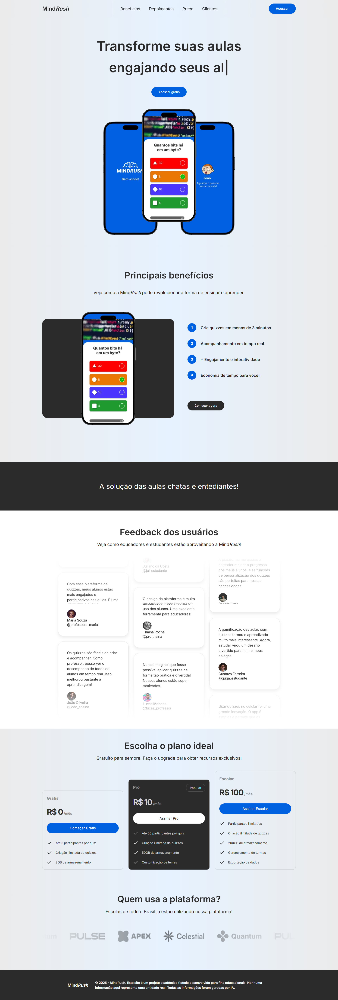
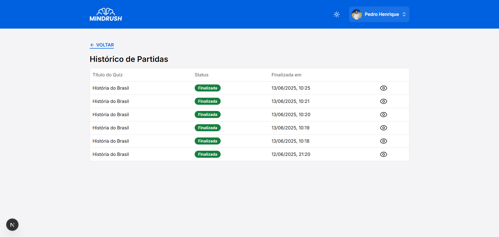
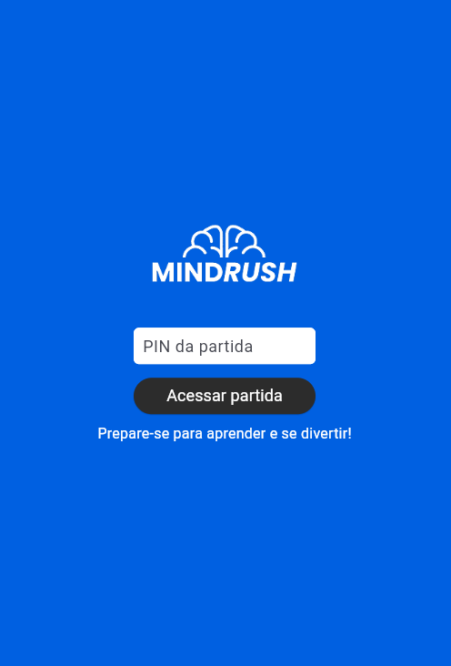

# Projeto da solução

Este documento apresenta uma visão geral da solução desenvolvida para o Mindrush, detalhando as principais telas e funcionalidades do sistema web e aplicativo.

## Web

### Início

Página inicial do Mindrush, apresentando o sistema e suas principais funcionalidades.

### Dashboard

Painel principal para gerenciar quizzes, criar partidas e acessar o histórico.

### Histórico de Partidas

Lista as partidas realizadas recentemente.

### Visualização de uma partida já finalizada através do Histórico de Partidas

Mostra o ranking de uma partida finalizada.

### Criar quiz

Permite criar quizzes do zero, por tema ou PDF.

### Criar perguntas

Adicionar e editar perguntas em um quiz.

Há também a possibilidade de criar perguntas do tipo Verdadeiro ou Falso.
Tela para criar perguntas do tipo Verdadeiro ou Falso.

### Lobby de espera partida

Sala de espera antes do início da partida, com QR Code e PIN.

### Partida em andamento

Exibe a pergunta e alternativas durante a partida.

### Ranking parcial

Mostra o ranking parcial após cada pergunta.

### Ranking final

Mostra o ranking final ao término da partida.

## App

### Início

Tela inicial do aplicativo, onde o usuário pode começar a participar de uma partida.

### Entrar na partida

Tela para inserir o PIN e acessar uma partida.

### Inserir apelido

Tela para o usuário digitar seu apelido antes de entrar na partida.

### Lobby da partida

Sala de espera até o início da partida.

### Partida em andamento

Exibe a pergunta e as alternativas para o usuário responder durante a partida.

### Ranking parcial

Mostra a classificação dos participantes após cada pergunta.

### Ranking final

Exibe a pontuação final dos participantes ao término da partida.

