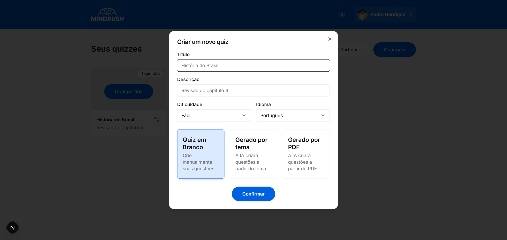
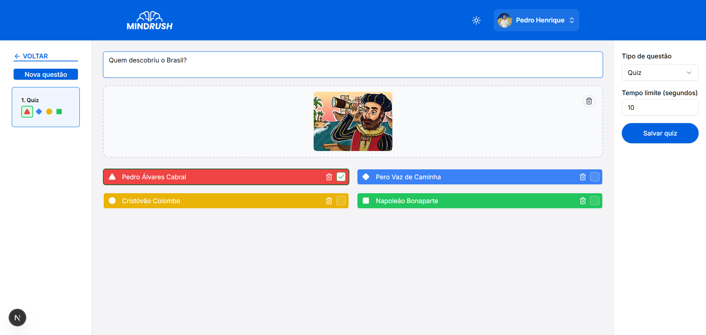

# Projeto da solução

Este documento apresenta uma visão geral da solução desenvolvida para o Mindrush, detalhando as principais telas e funcionalidades do sistema web e aplicativo.

## Web

### Tela de início
Página inicial do Mindrush, apresentando o sistema e suas principais funcionalidades.

### Dashboard 
Painel principal onde é possível gerenciar quizzes, criar novas partidas e acessar o histórico de jogos.

### Histórico de Partidas
Exibe as partidas realizadas recentemente.

### Criar quiz
Permite criar novos quizzes do zero, por tema ou a partir de um arquivo PDF.

### Criar perguntas
Tela para adicionar e editar perguntas em um quiz.

### Lobby de espera partida
Espaço de espera antes do início da partida, com exibição de QR Code e PIN para acesso.

### Partida em andamento
Mostra a pergunta atual e as alternativas durante a realização da partida.

