# Solution Design

This document presents an overview of the solution developed for MindRush, detailing the main screens and functionalities of the web system and application.

## Web

### Home

MindRush home page, presenting the system and its main functionalities.

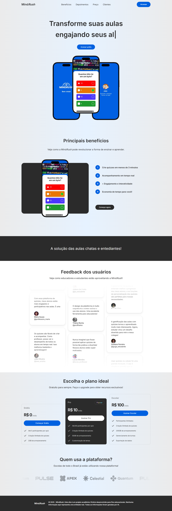

### Dashboard

Main panel to manage quizzes, create matches and access history.

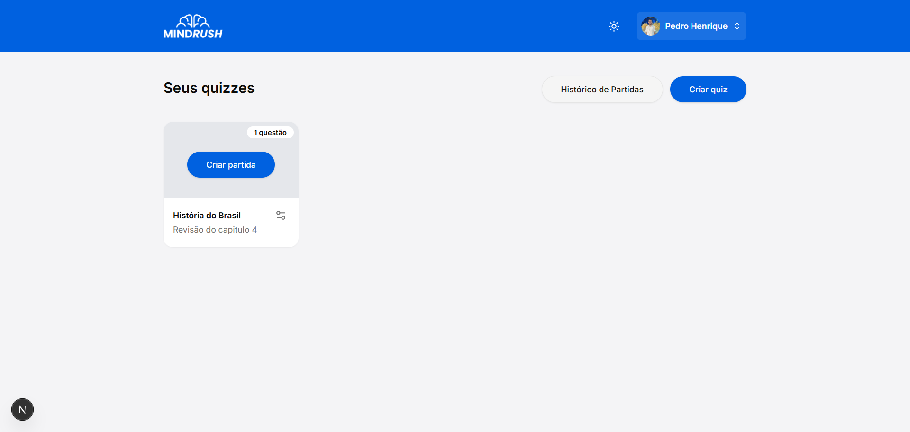

### Match History

Lists recently completed matches.

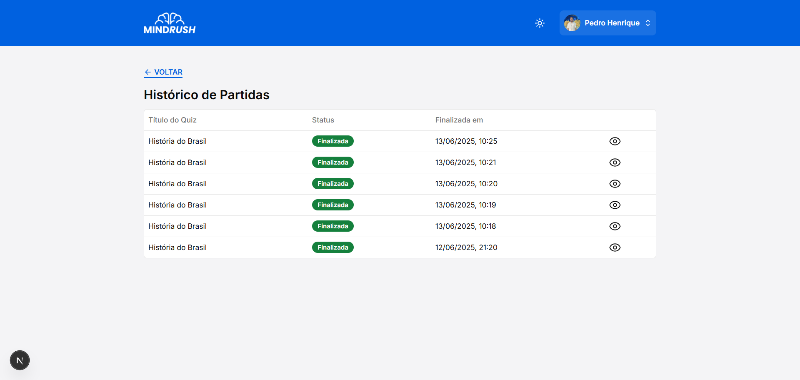

### Viewing a finished match through Match History

Shows the ranking of a finished match.

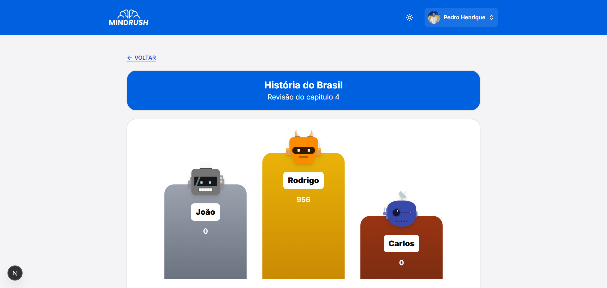

### Create quiz

Allows creating quizzes from scratch, by theme or PDF.

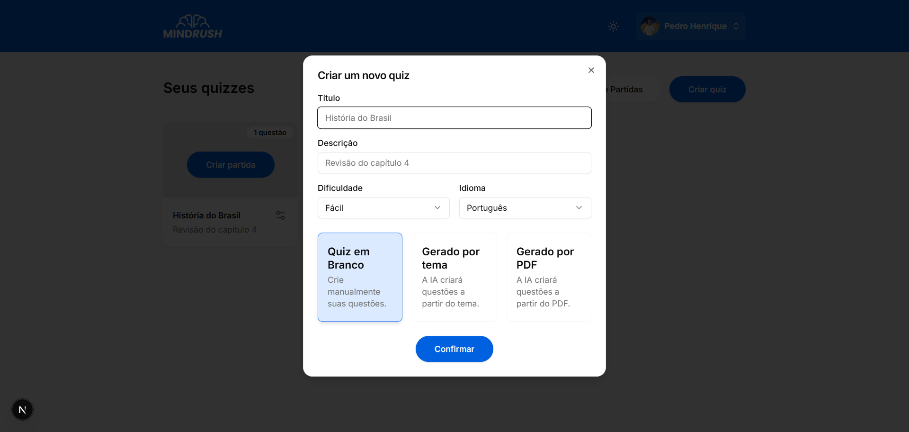

### Create questions

Add and edit questions in a quiz.

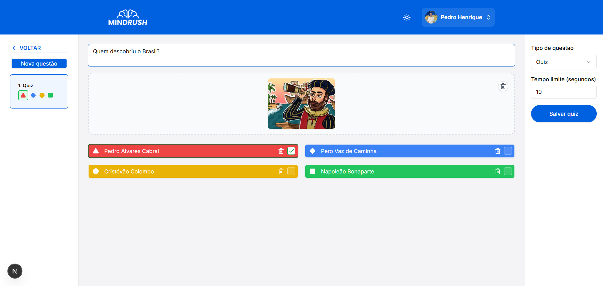

There is also the possibility to create True or False type questions.
Screen to create True or False type questions.
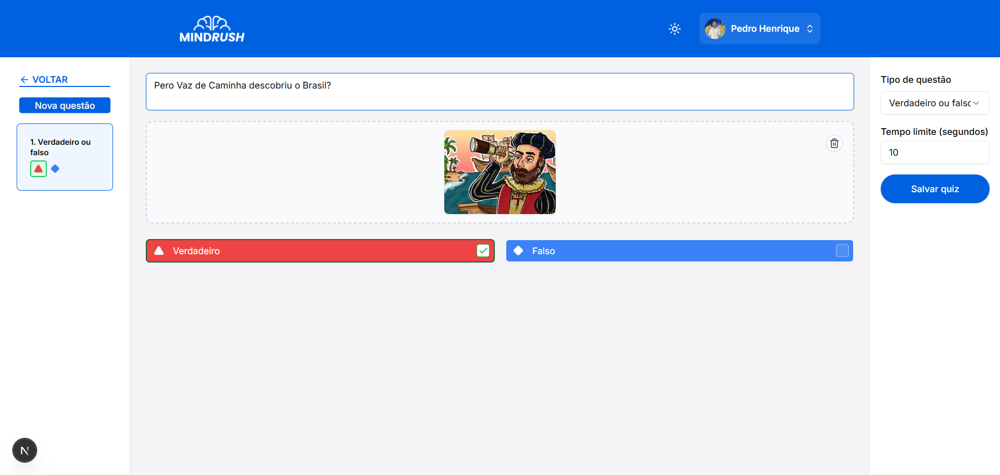

### Match waiting lobby

Waiting room before the match starts, with QR Code and PIN.

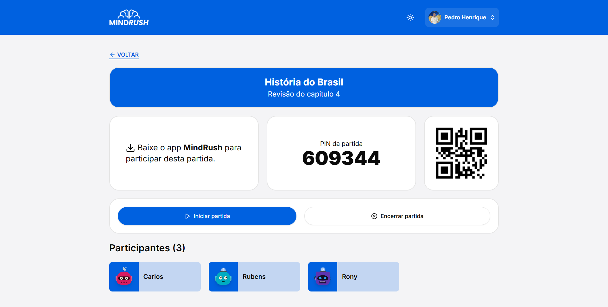

### Match in progress

Displays the question and alternatives during the match.

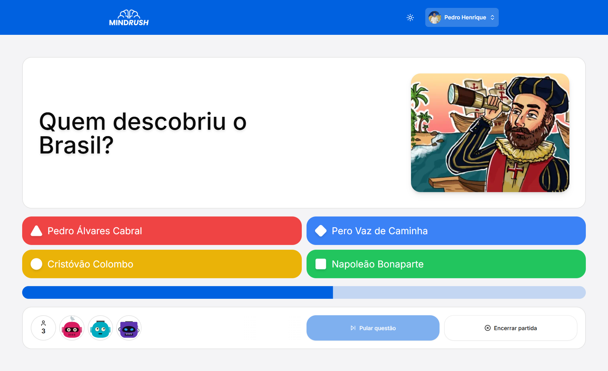

### Partial ranking

Shows the partial ranking after each question.

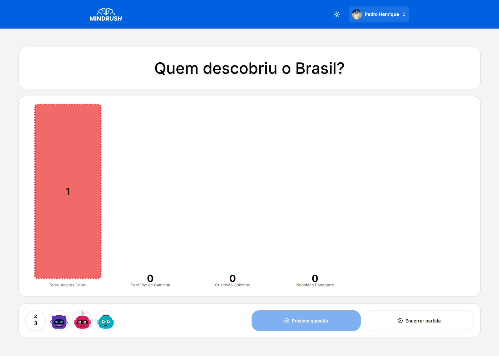

### Final ranking

Shows the final ranking at the end of the match.

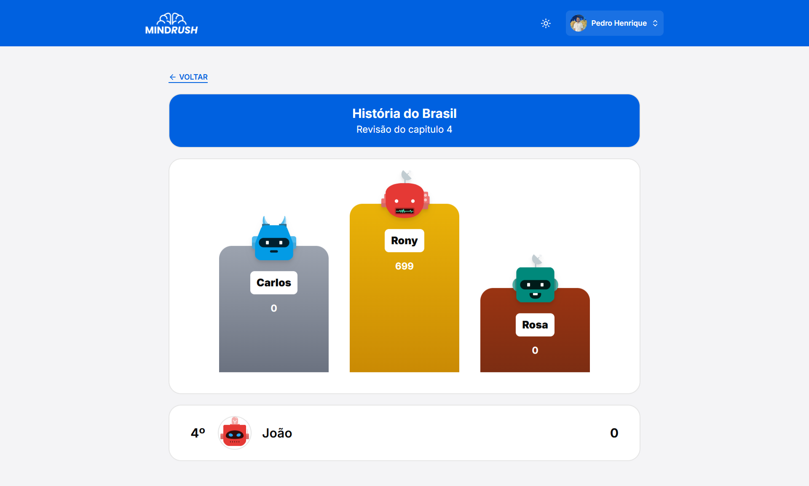

## App

### Home

Initial application screen, where the user can start participating in a match.

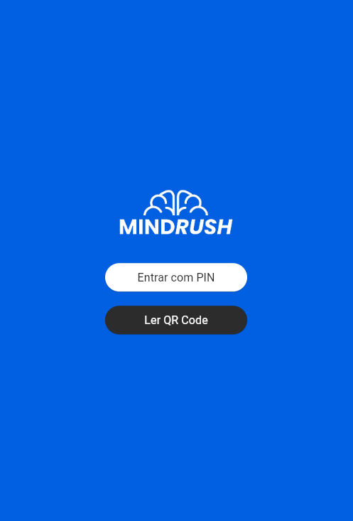

### Join match

Screen to enter the PIN and access a match.

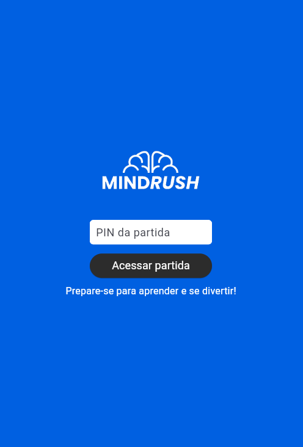

### Enter nickname

Screen for the user to type their nickname before entering the match.

### Match lobby

Waiting room until the match starts.

### Match in progress

Displays the question and alternatives for the user to answer during the match.

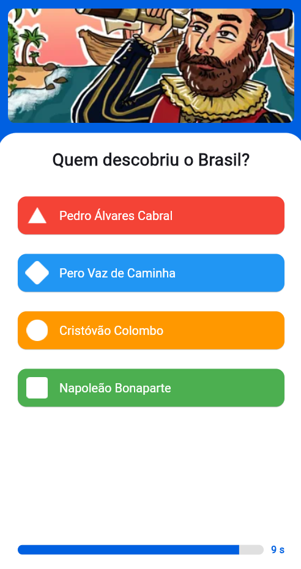

### Partial ranking

Shows the participants' classification after each question.

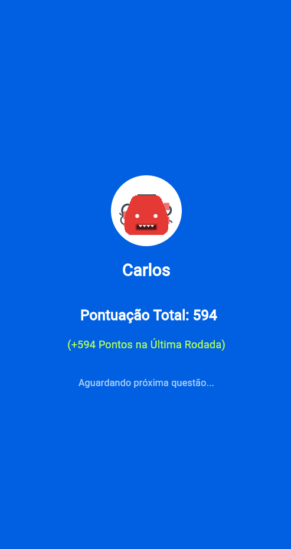

### Final ranking

Displays the participants' final scores at the end of the match.

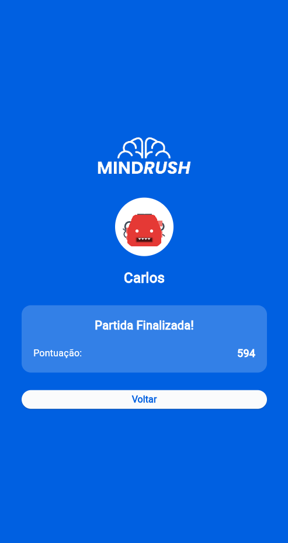
