# Wireframes

Wireframes are visual representations of how the application and web screens will be organized. They help visualize the structure and layout before development.

## Application Wireframes

### Home screen

### RF9: The student enters a code to access a match.

### RF11: The student enters a nickname that will identify them in the match.

### Waiting lobby

### Match loading.

### Question display.

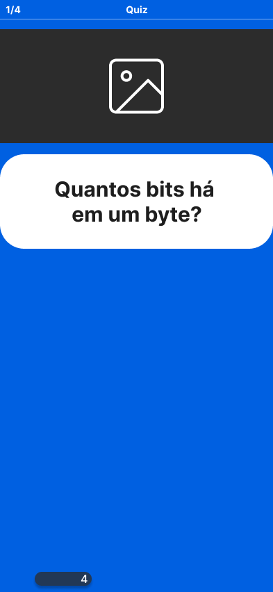

### RF12: The student answers match questions in real-time. (Multiple choice)

#### RF12: Correct answer.

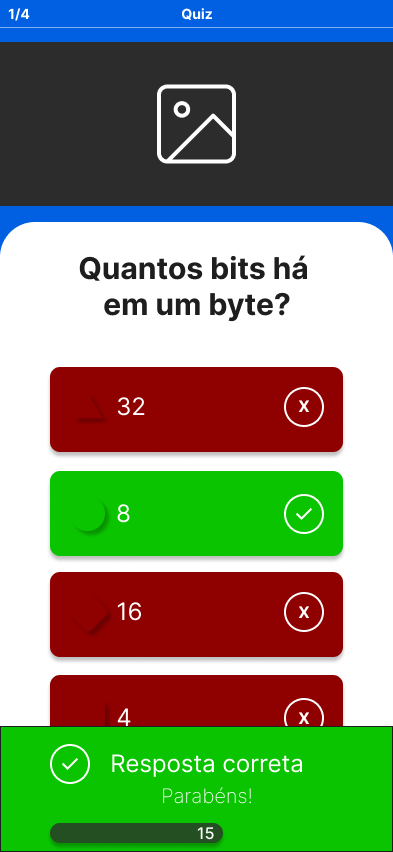

#### RF12: Wrong answer.

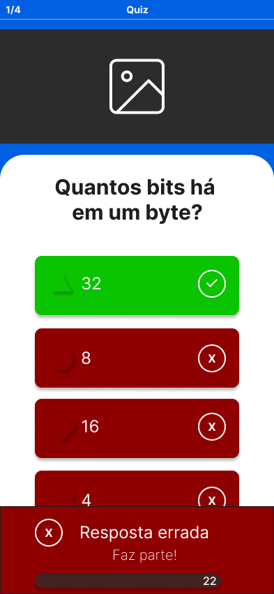

### RF12: The student answers match questions in real-time. (True or false)

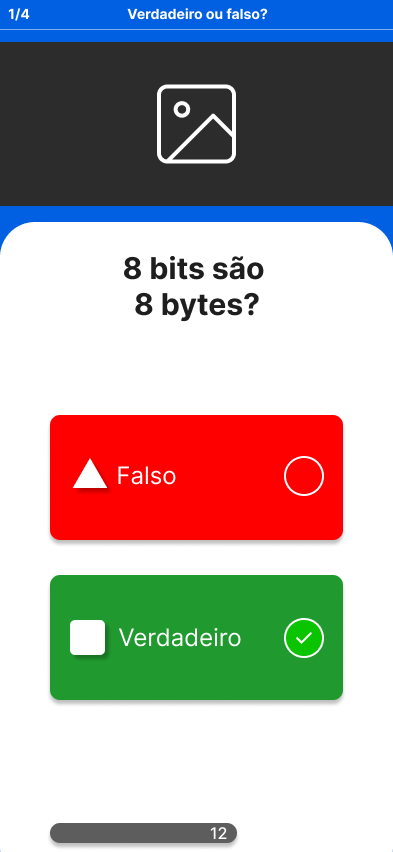

#### RF12: Correct answer. (True or false)

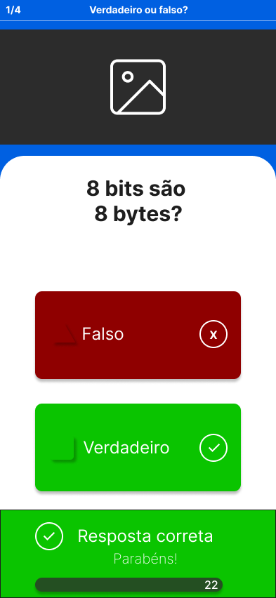

#### RF12: Wrong answer. (True or false)

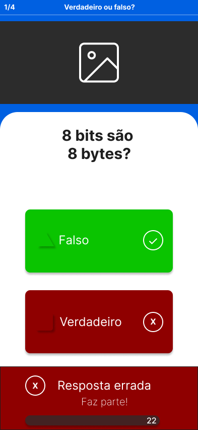

## Web Wireframe

### RF2: The educator manages the quizzes.

#### RF2: Modal to create a quiz.

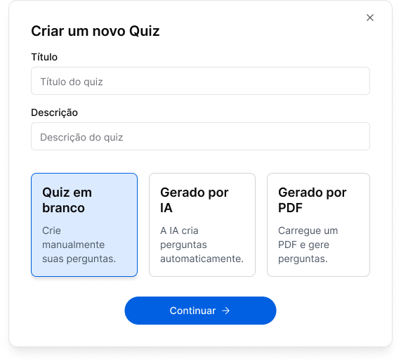

#### RF2: Step for quizzes generated by AI.

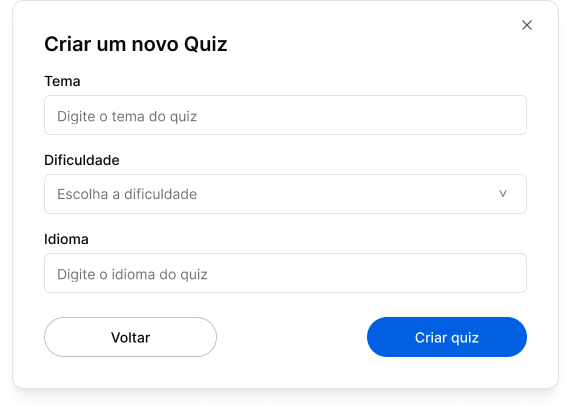

#### RF2: Step for quizzes generated by PDF.

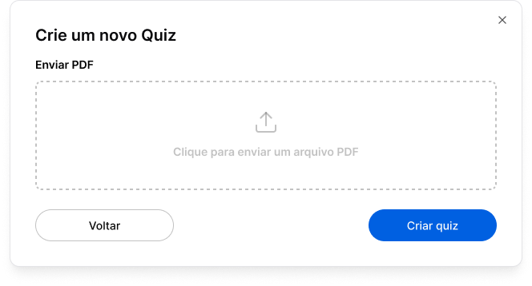

### RF5: The educator manages the questions of the quizzes.

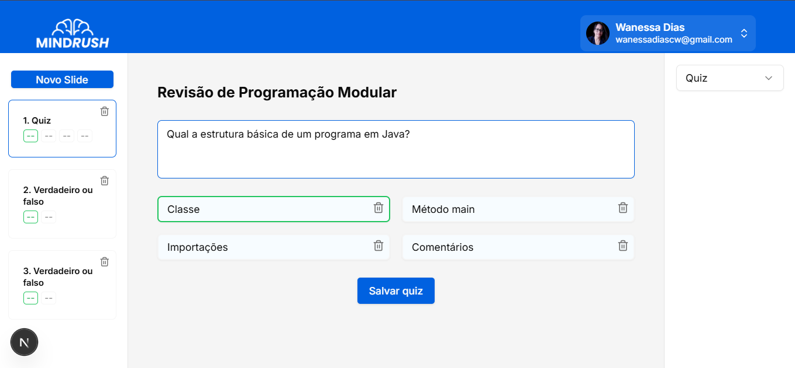

### RF6: The educator generates a match from a quiz.

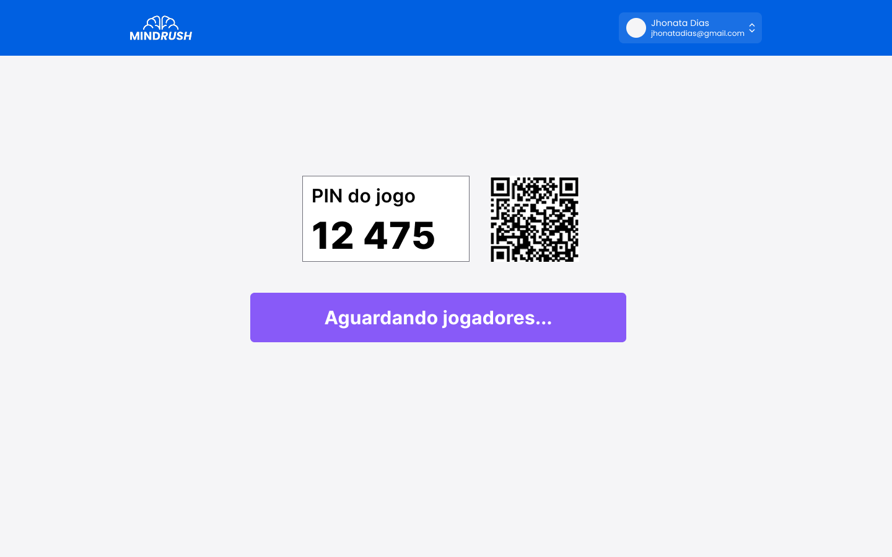

### RF7: The educator starts and ends a match.

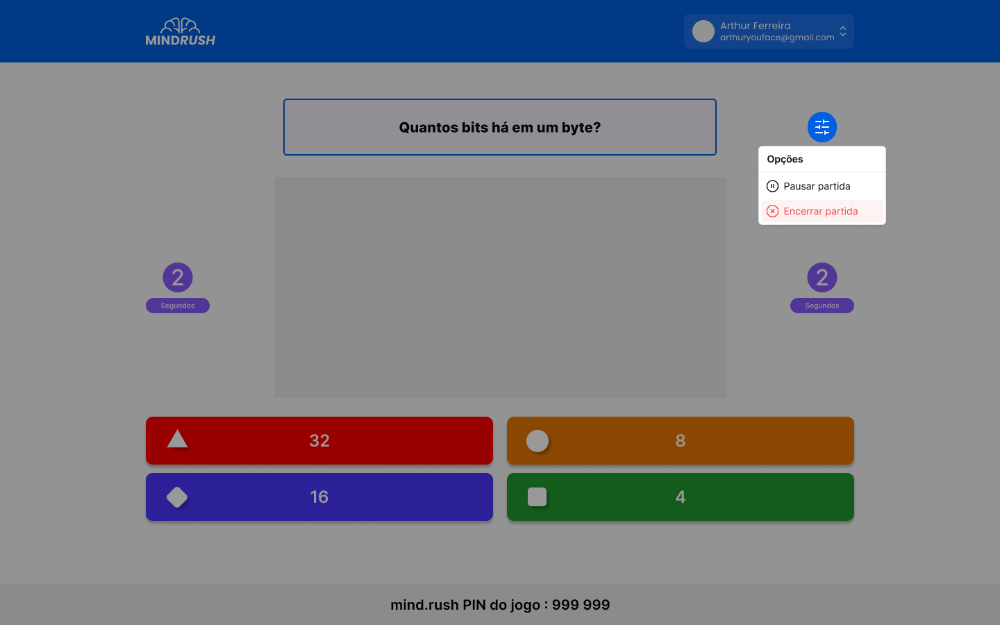

### RF8: The educator monitors the progress of the match.

#### RF8: Waiting for players.

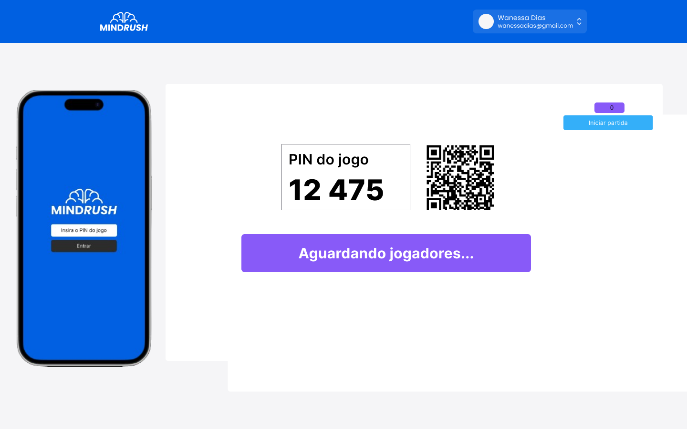

#### RF8: Players in the room.

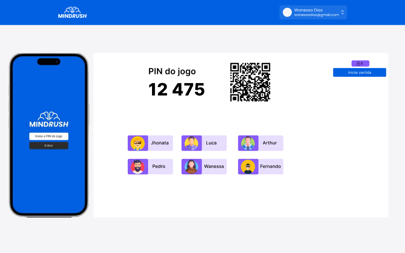

#### RF8: Correct answers to the questions.

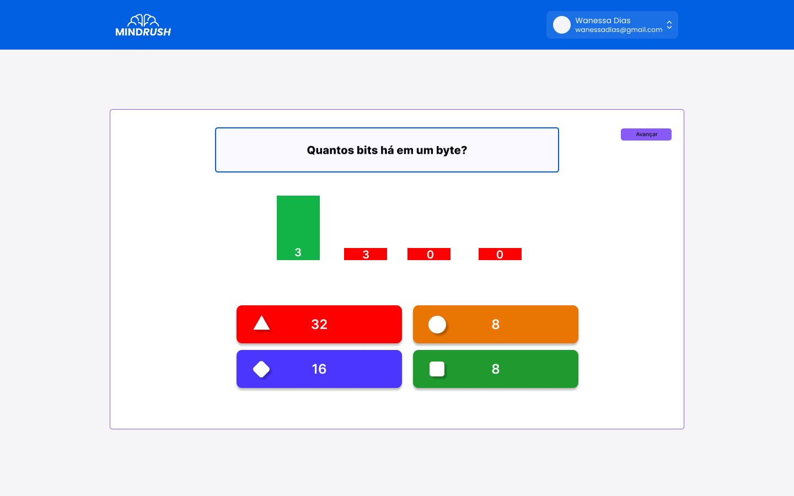
