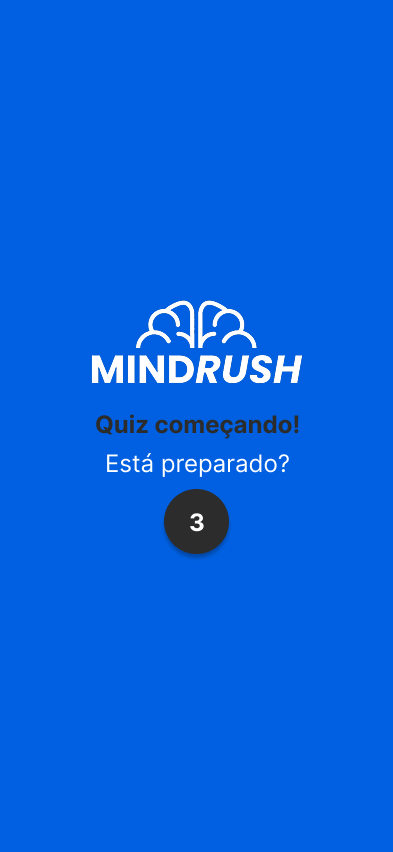
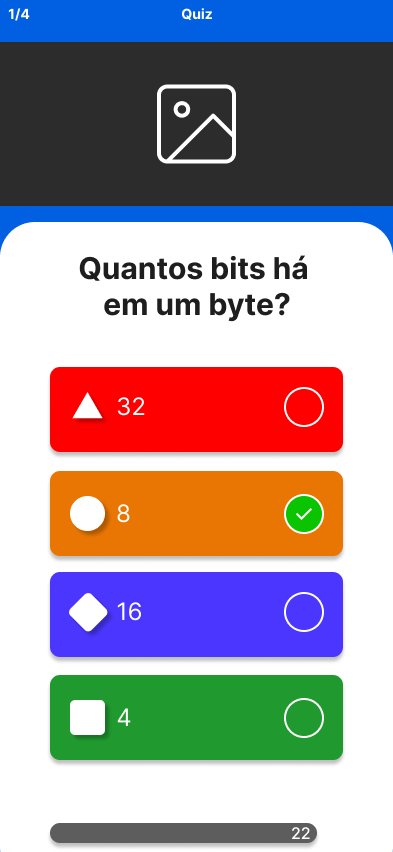

# Wireframes

Os wireframes são representações visuais de como as telas do aplicativo e da web serão organizadas. Eles ajudam a visualizar a estrutura e o layout antes do desenvolvimento.

## Wireframes do Aplicativo

### Tela de início

### RF9: O estudante informa um código para acessar uma partida.

### RF11: O estudante informa um apelido que o identificará na partida.

### Lobby de espera

### Carregamento da partida.

### Exibição da pergunta.

### RF12: O estudante responde às questões da partida em tempo real. (Múltipla escolha)

#### RF12: Resposta correta.

#### RF12: Resposta errada.

### RF12: O estudante responde às questões da partida em tempo real. (Verdadeiro ou falso)

#### RF12: Resposta correta. (Verdadeiro ou falso)

#### RF12: Resposta errada. (Verdadeiro ou falso)

## Wireframe Web

### RF2: O educador gerencia os quizzes.

#### RF2: Modal para criar um quiz.

#### RF2: Step para quizzes gerados por IA.

#### RF2: Step para quizzes gerados por PDF.

### RF5: O educador gerencia as questões dos quizzes.

### RF6: O educador gera uma partida a partir de um quiz.

### RF7: O educador inicia e encerra uma partida.

### RF8: O educador acompanha o andamento da partida.

#### RF8: Aguardando jogadores.

#### RF8: Jogadores em sala.

#### RF8: Acertos acerca das questões.

